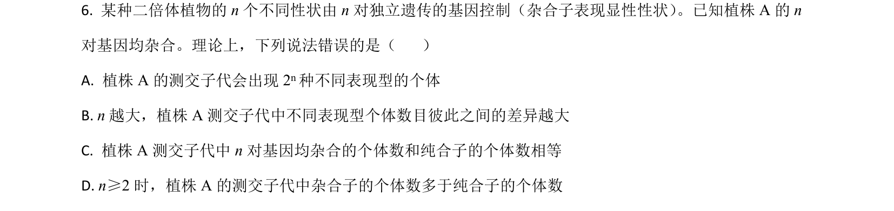
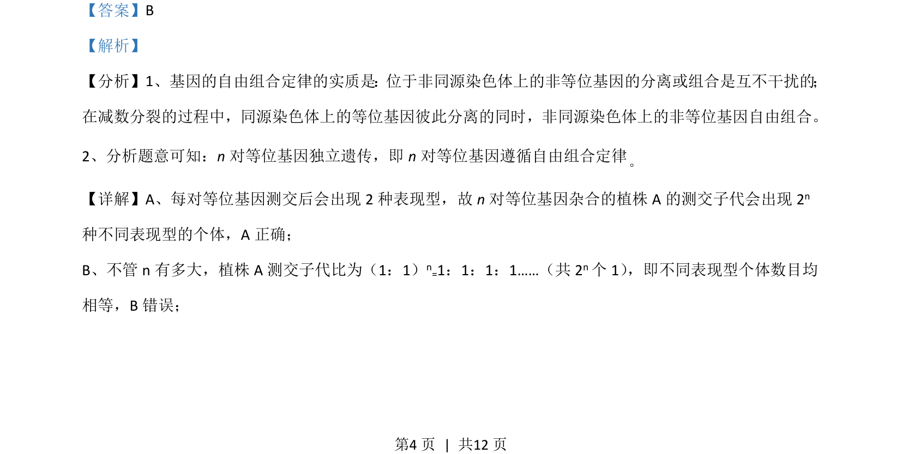
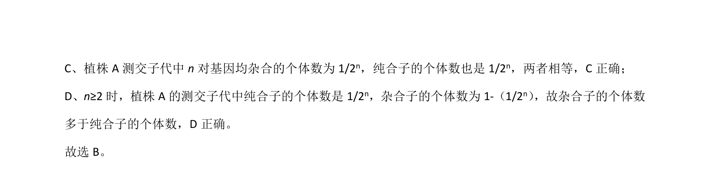

## 题面

## 摘要

考查n对独立遗传杂合基因的测交子代表现型种类与比例关系。

## 关联考点

- [[272-自由组合定律|基因的自由组合定律]]
- [[270-测交|测交]]
- [[705-表现型比例|表现型比例]]
- [[614-杂合子|杂合子]]

## 答案与解析

> 📄 原 PDF 第 4 页：`素材/真题/吉林/2008-2024·（吉林）生物高考真题/2021年高考生物试卷（全国乙卷）（解析卷）.pdf`
