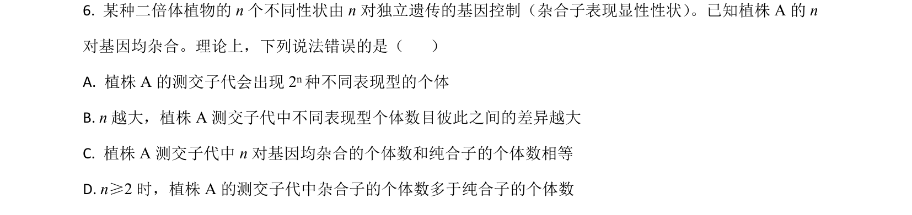
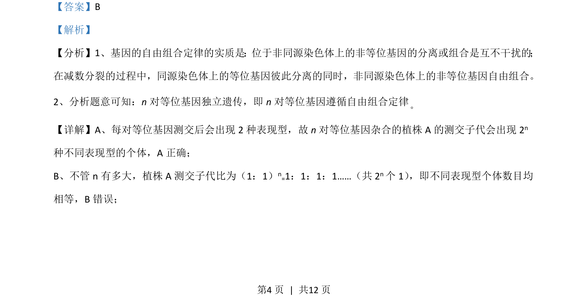
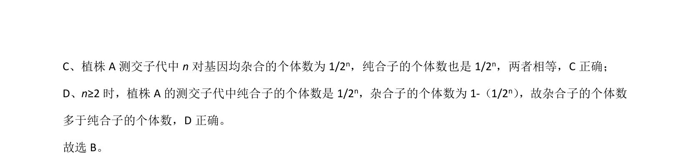

## 题面

## 摘要

考查n对独立遗传杂合基因的测交子代表现型种类与比例关系。

## 关联考点

- [[272-自由组合定律|基因的自由组合定律]]
- [[270-测交|测交]]
- [[705-表现型比例|表现型比例]]
- [[614-杂合子|杂合子]]

## 答案与解析

> 📄 原 PDF 第 4 页：`素材/真题/吉林/2008-2024·（吉林）生物高考真题/2021年高考生物试卷（全国乙卷）（解析卷）.pdf`

<!-- 题干文本-start -->
## 题干文本
6. 某种二倍体植物的 n 个不同性状由 n 对独立遗传的基因控制（杂合子表现显性性状） 。已知植株A 的 n
对基因均杂合。理论上，下列说法错误的是（    ）
A. 植株 A 的测交子代会出现 2n种不同表现型的个体
B. n 越大，植株 A 测交子代中不同表现型个体数目彼此之间的差异越大
C. 植株 A 测交子代中 n 对基因均杂合的个体数和纯合子的个体数相等
D. n≥2 时，植株 A 的测交子代中杂合子的个体数多于纯合子的个体数
<!-- 题干文本-end -->

<!-- 解析文本-start -->
## 解析文本
【答案】B
【解析】
【分析】1、基因的自由组合定律的实质是：位于非同源染色体上的非等位基因的分离或组合是互不干扰的；
在减数分裂的过程中，同源染色体上的等位基因彼此分离的同时，非同源染色体上的非等位基因自由组合。
2、分析题意可知：n 对等位基因独立遗传，即 n 对等位基因遵循自由组合定律
【详解】A、每对等位基因测交后会出现 2种表现型，故 n 对等位基因杂合的植株 A的测交子代会出现 2n
种不同表现型的个体，A正确；
B、不管 n 有多大，植株 A测交子代比为（1：1）n=1：1：1：1……（共 2n个 1） ，即不同表现型个体数目均
相等，B错误；
。
<!-- 解析文本-end -->
