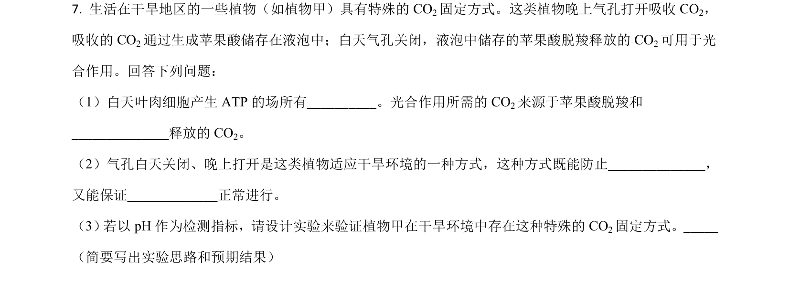
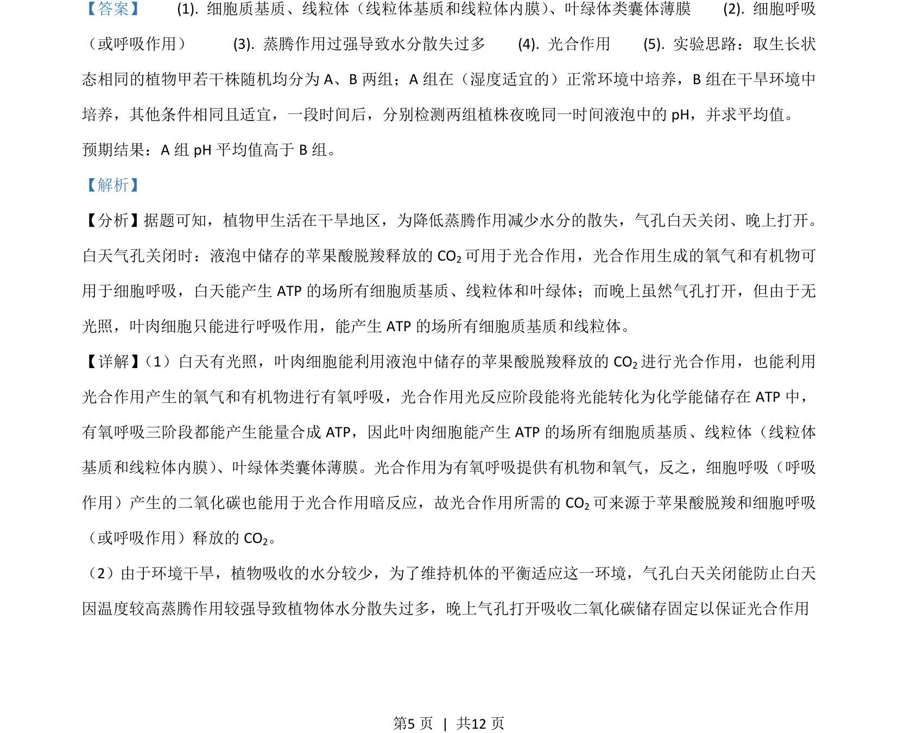
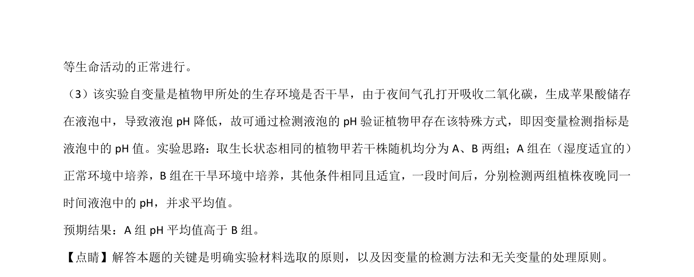

## 题面

## 摘要

该题以干旱区植物昼夜气孔开闭机制为背景，考查光合作用与呼吸作用的过程、场所、物质联系及实验设计能力。

## 关联考点

- [[033-光合作用|光合作用]]
- [[031-呼吸作用|呼吸作用]]
- [[813-细胞代谢|细胞代谢]]
- [[482-实验设计|实验探究]]

## 答案与解析

> 📄 原 PDF 第 5 页：`素材/真题/吉林/2008-2024·（吉林）生物高考真题/2021年高考生物试卷（全国乙卷）（解析卷）.pdf`
