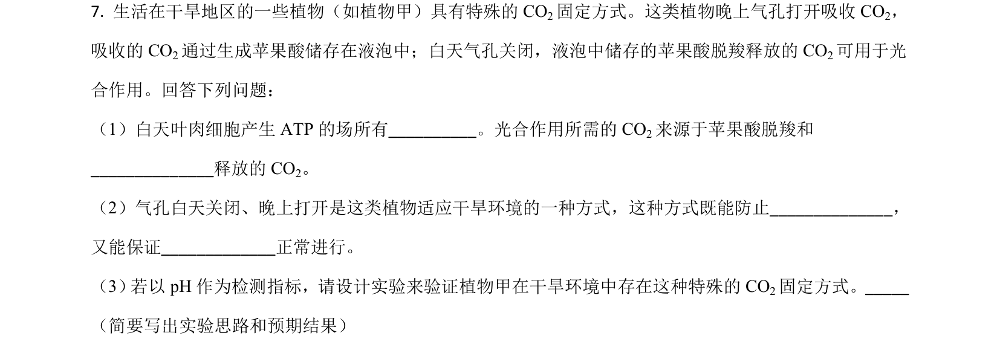
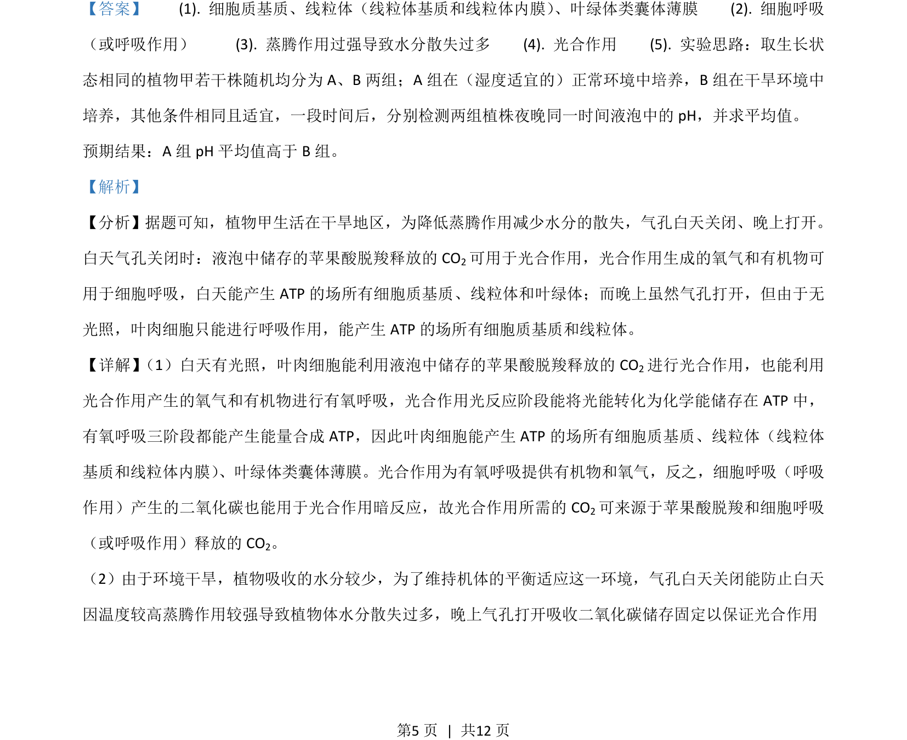
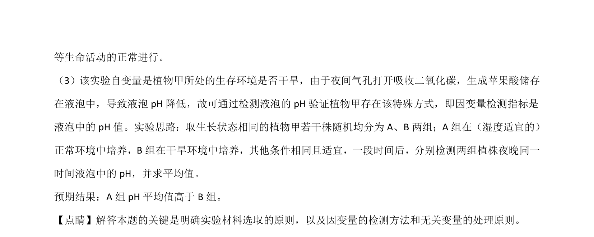

## 题面

## 摘要

该题以干旱区植物昼夜气孔开闭机制为背景，考查光合作用与呼吸作用的过程、场所、物质联系及实验设计能力。

## 关联考点

- [[033-光合作用|光合作用]]
- [[031-呼吸作用|呼吸作用]]
- [[813-细胞代谢|细胞代谢]]
- [[482-实验设计|实验探究]]

## 答案与解析

> 📄 原 PDF 第 5 页：`素材/真题/吉林/2008-2024·（吉林）生物高考真题/2021年高考生物试卷（全国乙卷）（解析卷）.pdf`

<!-- 题干文本-start -->
## 题干文本
7. 生活在干旱地区的一些植物（如植物甲）具有特殊的 CO2固定方式。这类植物晚上气孔打开吸收 CO2，
吸收的 CO2通过生成苹果酸储存在液泡中；白天气孔关闭，液泡中储存的苹果酸脱羧释放的 CO2可用于光
合作用。回答下列问题：
（1）白天叶肉细胞产生 ATP 的场所有__________。光合作用所需的 CO2来源于苹果酸脱羧和
______________释放的 CO2。
（2）气孔白天关闭、晚上打开是这类植物适应干旱环境的一种方式，这种方式既能防止______________，
又能保证_____________正常进行。
（3） 若以pH 作为检测指标，请设计实验来验证植物甲在干旱环境中存在这种特殊的 CO2固定方式。_____
（简要写出实验思路和预期结果）
<!-- 题干文本-end -->

<!-- 解析文本-start -->
## 解析文本
【答案】    (1). 细胞质基质、线粒体（线粒体基质和线粒体内膜） 、叶绿体类囊体薄膜    (2). 细胞呼吸
（或呼吸作用）     (3). 蒸腾作用过强导致水分散失过多    (4). 光合作用    (5). 实验思路：取生长状
态相同的植物甲若干株随机均分为 A、B 两组；A 组在（湿度适宜的）正常环境中培养，B 组在干旱环境中
培养，其他条件相同且适宜，一段时间后，分别检测两组植株夜晚同一时间液泡中的 pH，并求平均值。
预期结果：A组 pH 平均值高于 B组。
【解析】
【分析】据题可知，植物甲生活在干旱地区，为降低蒸腾作用减少水分的散失，气孔白天关闭、晚上打开。
白天气孔关闭时：液泡中储存的苹果酸脱羧释放的 CO2可用于光合作用，光合作用生成的氧气和有机物可
用于细胞呼吸，白天能产生 ATP 的场所有细胞质基质、线粒体和叶绿体；而晚上虽然气孔打开，但由于无
光照，叶肉细胞只能进行呼吸作用，能产生 ATP的场所有细胞质基质和线粒体。
【详解】 （1）白天有光照，叶肉细胞能利用液泡中储存的苹果酸脱羧释放的 CO2进行光合作用，也能利用
光合作用产生的氧气和有机物进行有氧呼吸，光合作用光反应阶段能将光能转化为化学能储存在 ATP 中，
有氧呼吸三阶段都能产生能量合成 ATP，因此叶肉细胞能产生 ATP 的场所有细胞质基质、线粒体（线粒体
基质和线粒体内膜） 、叶绿体类囊体薄膜。光合作用为有氧呼吸提供有机物和氧气，反之，细胞呼吸（呼吸
作用）产生的二氧化碳也能用于光合作用暗反应，故光合作用所需的 CO2可来源于苹果酸脱羧和细胞呼吸
（或呼吸作用）释放的 CO2。
（2）由于环境干旱，植物吸收的水分较少，为了维持机体的平衡适应这一环境，气孔白天关闭能防止白天
因温度较高蒸腾作用较强导致植物体水分散失过多，晚上气孔打开吸收二氧化碳储存固定以保证光合作用
<!-- 解析文本-end -->
