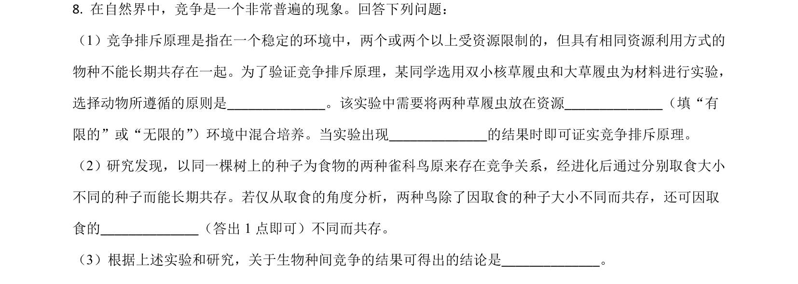
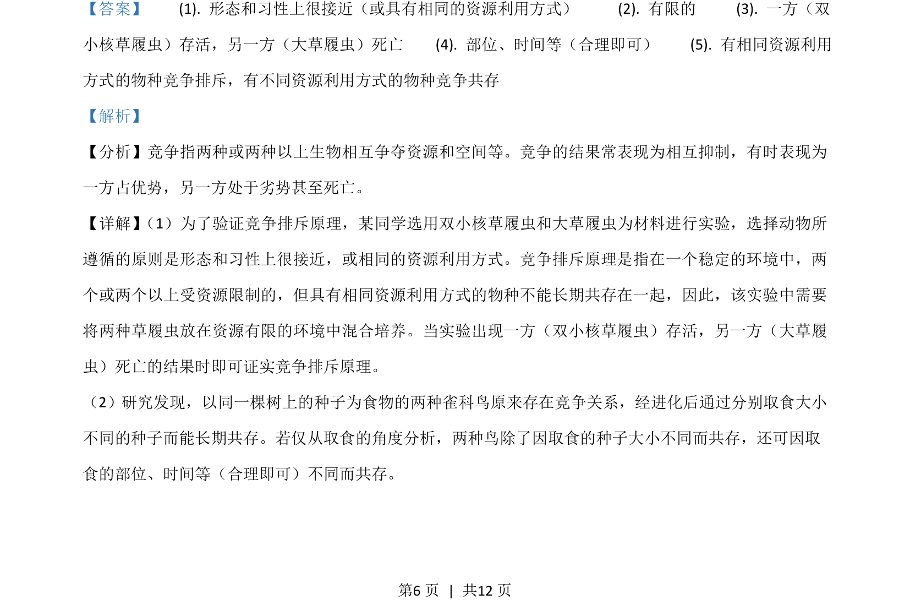
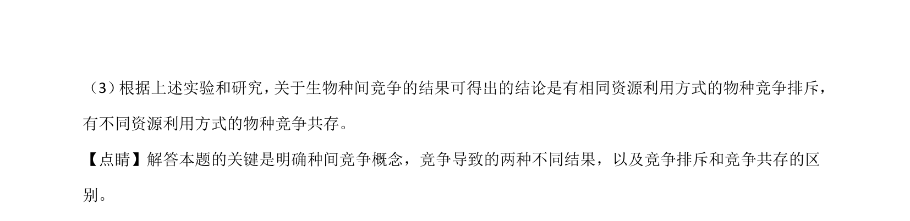

## 题面

## 摘要

该题考查双小核草履虫和大草履虫的竞争排斥实验设计及种间竞争结果分析。

## 关联考点

- [[766-竞争排斥原理|竞争排斥原理]]
- [[667-种间竞争|种间竞争]]
- [[712-资源利用方式|资源利用方式]]

## 答案与解析

> 📄 原 PDF 第 6 页：`素材/真题/吉林/2008-2024·（吉林）生物高考真题/2021年高考生物试卷（全国乙卷）（解析卷）.pdf`
