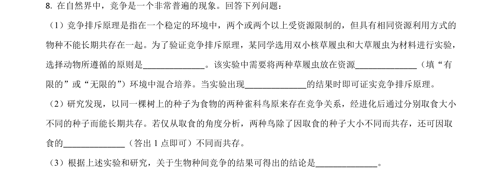
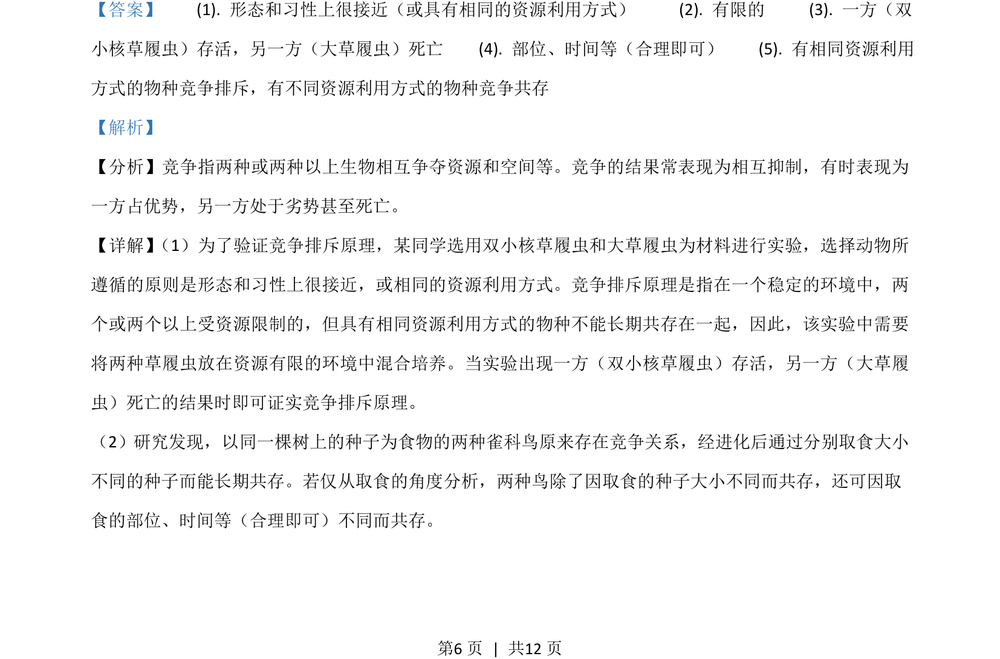
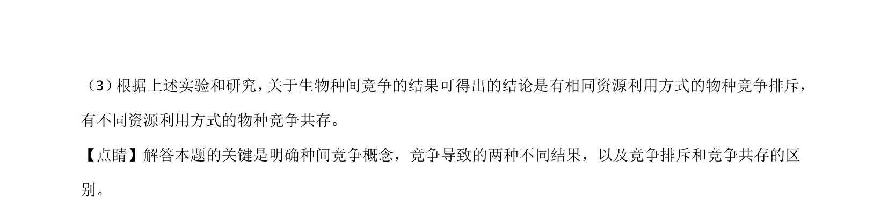

## 题面

## 摘要

该题考查双小核草履虫和大草履虫的竞争排斥实验设计及种间竞争结果分析。

## 关联考点

- [[766-竞争排斥原理|竞争排斥原理]]
- [[667-种间竞争|种间竞争]]
- [[712-资源利用方式|资源利用方式]]

## 答案与解析

> 📄 原 PDF 第 6 页：`素材/真题/吉林/2008-2024·（吉林）生物高考真题/2021年高考生物试卷（全国乙卷）（解析卷）.pdf`

<!-- 题干文本-start -->
## 题干文本
8. 在自然界中，竞争是一个非常普遍的现象。回答下列问题：
（1）竞争排斥原理是指在一个稳定的环境中，两个或两个以上受资源限制的，但具有相同资源利用方式的
物种不能长期共存在一起。为了验证竞争排斥原理，某同学选用双小核草履虫和大草履虫为材料进行实验，
选择动物所遵循的原则是______________。该实验中需要将两种草履虫放在资源______________（填“有
限的”或“无限的”）环境中混合培养。当实验出现______________的结果时即可证实竞争排斥原理。
（2）研究发现，以同一棵树上的种子为食物的两种雀科鸟原来存在竞争关系，经进化后通过分别取食大小
不同的种子而能长期共存。若仅从取食的角度分析，两种鸟除了因取食的种子大小不同而共存，还可因取
食的______________（答出 1 点即可）不同而共存。
（3）根据上述实验和研究，关于生物种间竞争的结果可得出的结论是______________。
<!-- 题干文本-end -->

<!-- 解析文本-start -->
## 解析文本
【答案】    (1). 形态和习性上很接近（或具有相同的资源利用方式）     (2). 有限的     (3). 一方（双
小核草履虫）存活，另一方（大草履虫）死亡    (4). 部位、时间等（合理即可）    (5). 有相同资源利用
方式的物种竞争排斥，有不同资源利用方式的物种竞争共存
【解析】
【分析】竞争指两种或两种以上生物相互争夺资源和空间等。竞争的结果常表现为相互抑制，有时表现为
一方占优势，另一方处于劣势甚至死亡。
【详解】 （1）为了验证竞争排斥原理，某同学选用双小核草履虫和大草履虫为材料进行实验，选择动物所
遵循的原则是形态和习性上很接近，或相同的资源利用方式。竞争排斥原理是指在一个稳定的环境中，两
个或两个以上受资源限制的，但具有相同资源利用方式的物种不能长期共存在一起，因此，该实验中需要
将两种草履虫放在资源有限的环境中混合培养。当实验出现一方（双小核草履虫）存活，另一方（大草履
虫）死亡的结果时即可证实竞争排斥原理。
（2）研究发现，以同一棵树上的种子为食物的两种雀科鸟原来存在竞争关系，经进化后通过分别取食大小
不同的种子而能长期共存。若仅从取食的角度分析，两种鸟除了因取食的种子大小不同而共存，还可因取
食的部位、时间等（合理即可）不同而共存。
<!-- 解析文本-end -->
