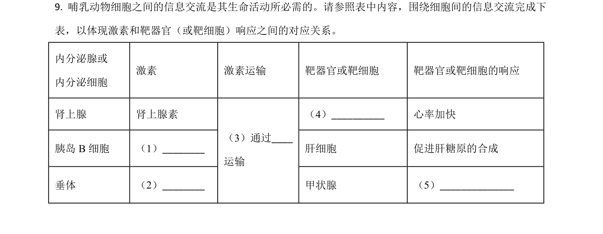
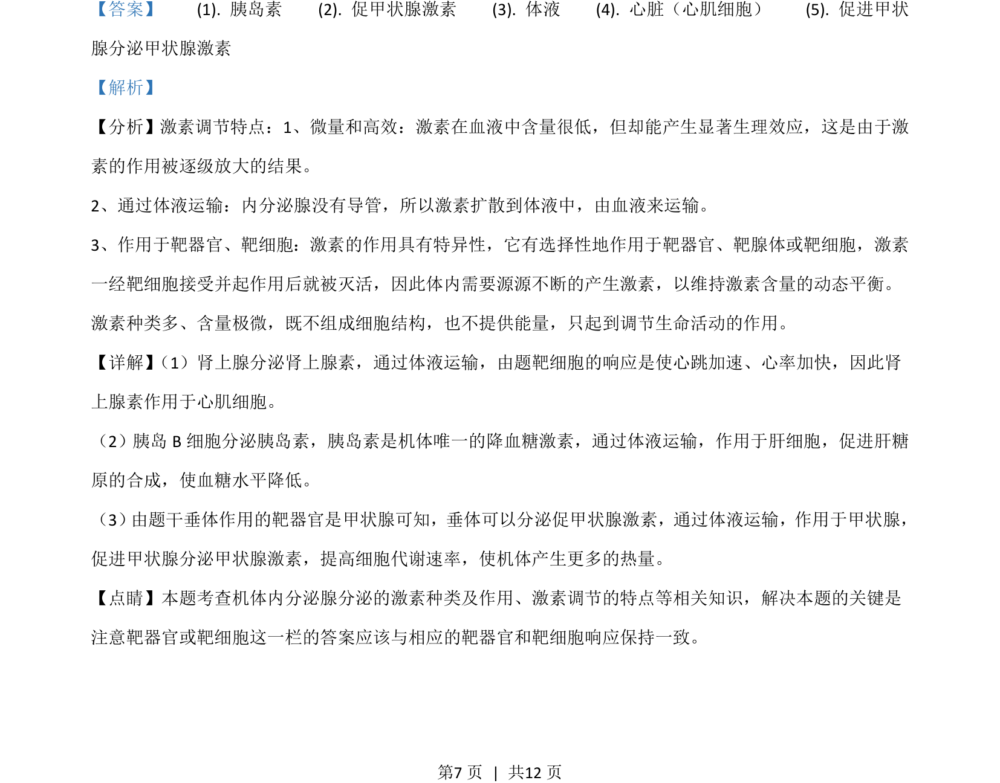

## 题面

## 摘要

该题考查激素调节特点和遗传规律的应用，涉及内分泌、血糖调节、伴性遗传和自由组合定律。

## 关联考点

- [[331-激素调节|激素调节]]
- [[体温调节]]
- [[276-伴性遗传|伴性遗传]]
- [[272-自由组合定律|自由组合定律]]

## 答案与解析

> 📄 原 PDF 第 7 页：`素材/真题/吉林/2008-2024·（吉林）生物高考真题/2021年高考生物试卷（全国乙卷）（解析卷）.pdf`
