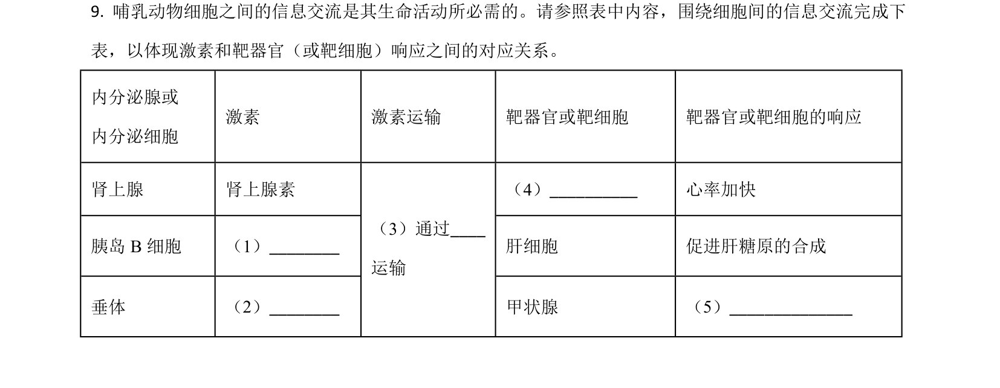
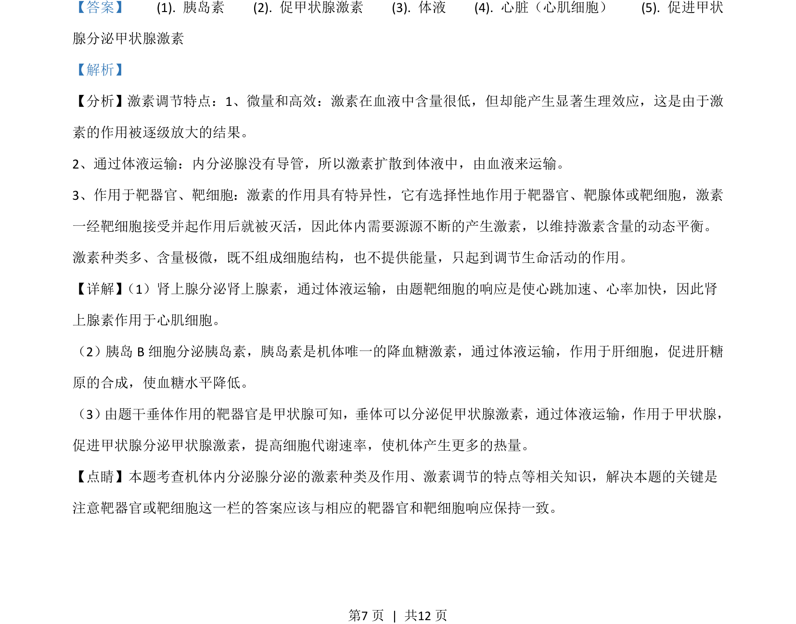

## 题面

## 摘要

该题考查激素调节特点和遗传规律的应用，涉及内分泌、血糖调节、伴性遗传和自由组合定律。

## 关联考点

- [[331-激素调节|激素调节]]
- [[542-体温调节|体温调节]]
- [[276-伴性遗传|伴性遗传]]
- [[272-自由组合定律|自由组合定律]]

## 答案与解析

> 📄 原 PDF 第 7 页：`素材/真题/吉林/2008-2024·（吉林）生物高考真题/2021年高考生物试卷（全国乙卷）（解析卷）.pdf`

<!-- 题干文本-start -->
## 题干文本
9. 哺乳动物细胞之间的信息交流是其生命活动所必需的。请参照表中内容，围绕细胞间的信息交流完成下
表，以体现激素和靶器官（或靶细胞）响应之间的对应关系。
内分泌腺或
内分泌细胞
激素 激素运输 靶器官或靶细胞 靶器官或靶细胞的响应
肾上腺 肾上腺素 （4）__________ 心率加快
胰岛 B细胞 （1）________ 肝细胞 促进肝糖原的合成
垂体 （2）________
（3）通过____
运输
甲状腺 （5）______________
<!-- 题干文本-end -->

<!-- 解析文本-start -->
## 解析文本
【答案】    (1). 胰岛素    (2). 促甲状腺激素    (3). 体液    (4). 心脏（心肌细胞）    (5). 促进甲状
腺分泌甲状腺激素
【解析】
【分析】激素调节特点：1、微量和高效：激素在血液中含量很低，但却能产生显著生理效应，这是由于激
素的作用被逐级放大的结果。
2、通过体液运输：内分泌腺没有导管，所以激素扩散到体液中，由血液来运输。
3、作用于靶器官、靶细胞：激素的作用具有特异性，它有选择性地作用于靶器官、靶腺体或靶细胞，激素
一经靶细胞接受并起作用后就被灭活，因此体内需要源源不断的产生激素，以维持激素含量的动态平衡。
激素种类多、含量极微，既不组成细胞结构，也不提供能量，只起到调节生命活动的作用。
【详解】 （1）肾上腺分泌肾上腺素，通过体液运输，由题靶细胞的响应是使心跳加速、心率加快，因此肾
上腺素作用于心肌细胞。
（2）胰岛B细胞分泌胰岛素，胰岛素是机体唯一的降血糖激素，通过体液运输，作用于肝细胞，促进肝糖
原的合成，使血糖水平降低。
（3） 由题干垂体作用的靶器官是甲状腺可知，垂体可以分泌促甲状腺激素，通过体液运输，作用于甲状腺，
促进甲状腺分泌甲状腺激素，提高细胞代谢速率，使机体产生更多的热量。
【点睛】本题考查机体内分泌腺分泌的激素种类及作用、激素调节的特点等相关知识，解决本题的关键是
注意靶器官或靶细胞这一栏的答案应该与相应的靶器官和靶细胞响应保持一致。
<!-- 解析文本-end -->
