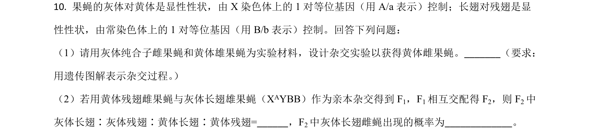
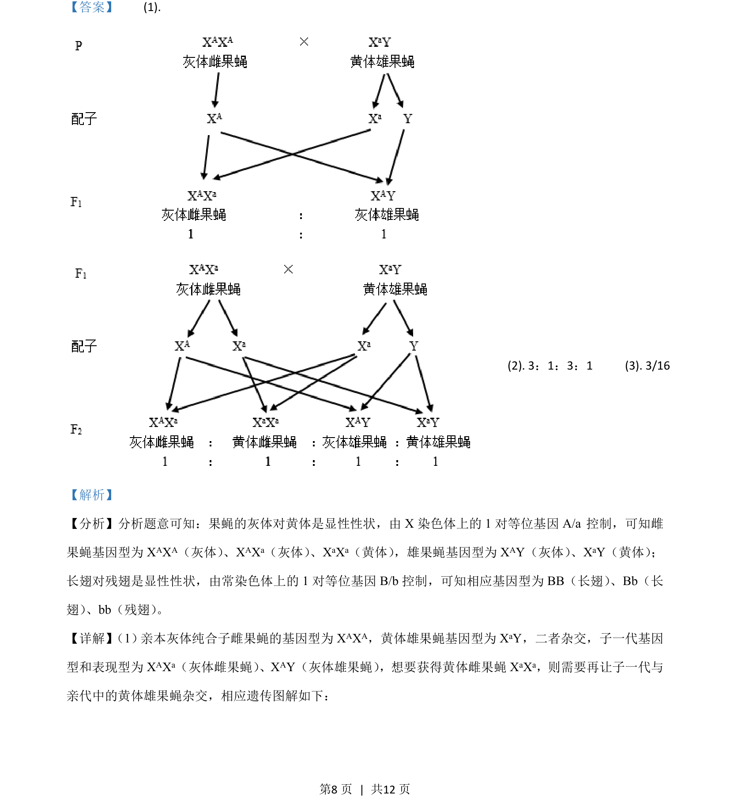
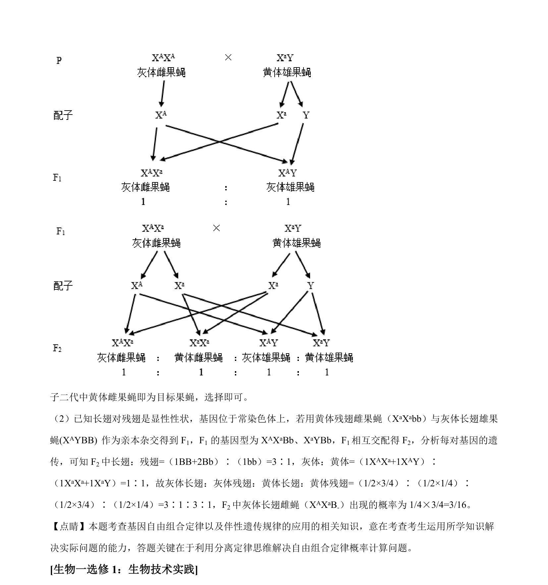

## 题面

## 摘要

果蝇伴性遗传与常染色体遗传的杂交实验设计及子代比例计算

## 关联考点

- [[276-伴性遗传|伴性遗传]]
- [[477-基因分离定律|基因分离定律]]
- [[272-自由组合定律|自由组合定律]]
- [[273-遗传图解|遗传图解]]

## 答案与解析

> 📄 原 PDF 第 8 页：`素材/真题/吉林/2008-2024·（吉林）生物高考真题/2021年高考生物试卷（全国乙卷）（解析卷）.pdf`

<!-- 题干文本-start -->
## 题干文本
10. 果蝇的灰体对黄体是显性性状，由 X 染色体上的 1 对等位基因（用 A/a表示）控制；长翅对残翅是显
性性状，由常染色体上的 1 对等位基因（用 B/b表示）控制。回答下列问题：
（1）请用灰体纯合子雌果蝇和黄体雄果蝇为实验材料，设计杂交实验以获得黄体雌果蝇。_______（要求：
用遗传图解表示杂交过程。 ）
（2）若用黄体残翅雌果蝇与灰体长翅雄果蝇（XAYBB）作为亲本杂交得到 F1，F1相互交配得 F2，则 F2中
灰体长翅∶灰体残翅∶黄体长翅∶黄体残翅=______，F2中灰体长翅雌蝇出现的概率为_____________。
<!-- 题干文本-end -->

<!-- 解析文本-start -->
## 解析文本
【答案】    (1). 
    (2). 3 ：1：3：1     (3). 3/16
【解析】
【分析】分析题意可知：果蝇的灰体对黄体是显性性状，由 X 染色体上的 1 对等位基因 A/a 控制，可知雌
果蝇基因型为 XAXA（灰体） 、XAXa（灰体） 、XaXa（黄体） ，雄果蝇基因型为XAY（灰体） 、XaY（黄体） ；
长翅对残翅是显性性状，由常染色体上的 1 对等位基因 B/b 控制，可知相应基因型为 BB（长翅） 、Bb（长
翅） 、bb（残翅） 。
【详解】 （1） 亲本灰体纯合子雌果蝇的基因型为XAXA，黄体雄果蝇基因型为 XaY，二者杂交，子一代基因
型和表现型为 XAXa（灰体雌果蝇） 、XAY（灰体雄果蝇） ，想要获得黄体雌果蝇XaXa，则需要再让子一代与
亲代中的黄体雄果蝇杂交，相应遗传图解如下：
<!-- 解析文本-end -->
