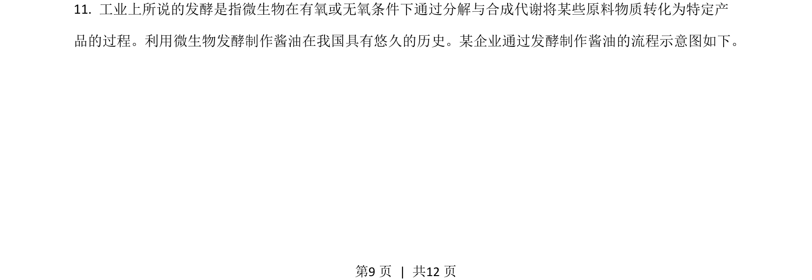
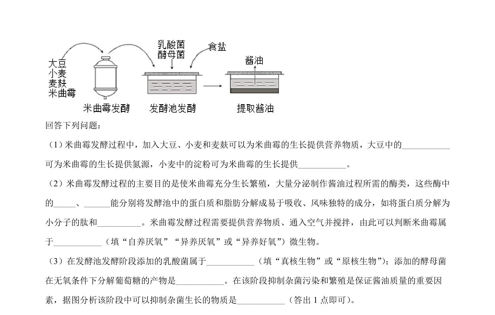
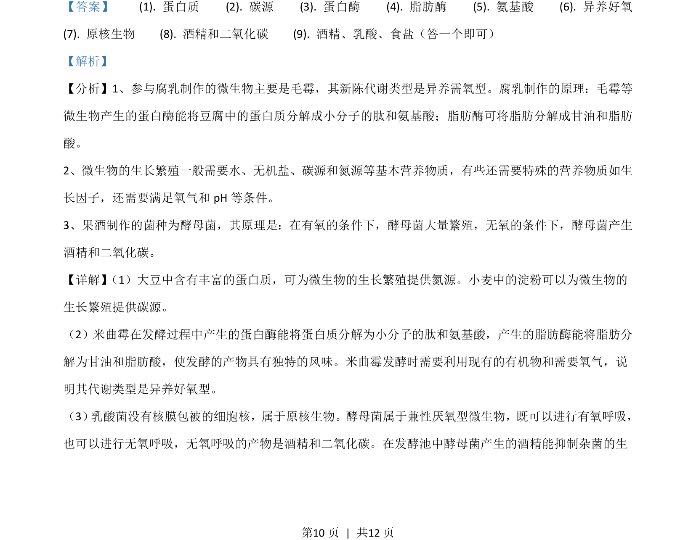
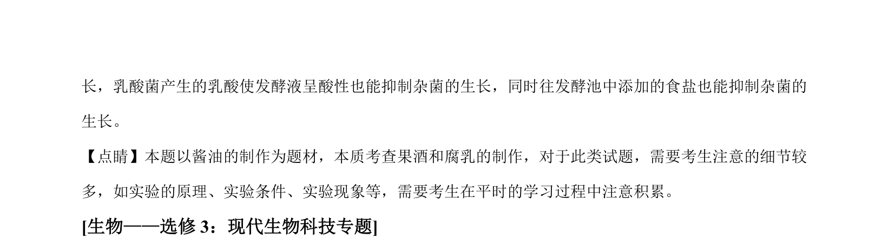

## 题面

## 摘要

考查工业发酵概念及酱油酿造流程中微生物的代谢与物质转化。

## 关联考点

- [[238-无氧呼吸|发酵]]
- [[486-微生物代谢|微生物代谢]]
- [[613-有氧条件|有氧条件]]
- [[607-无氧条件|无氧条件]]

## 答案与解析

> 📄 原 PDF 第 9 页：`素材/真题/吉林/2008-2024·（吉林）生物高考真题/2021年高考生物试卷（全国乙卷）（解析卷）.pdf`
