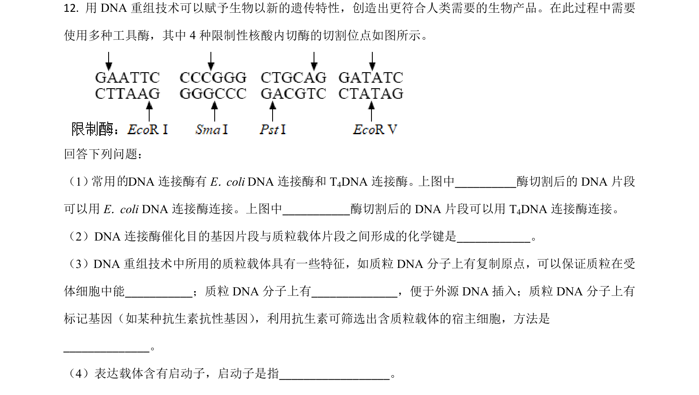
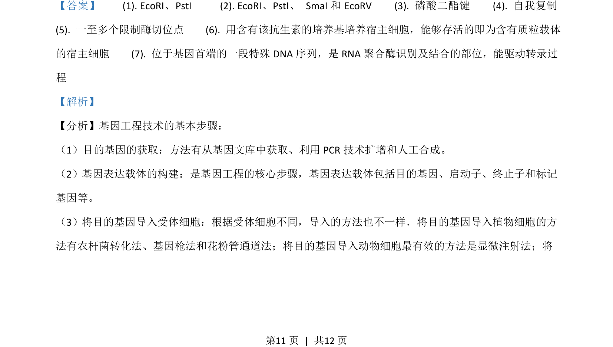
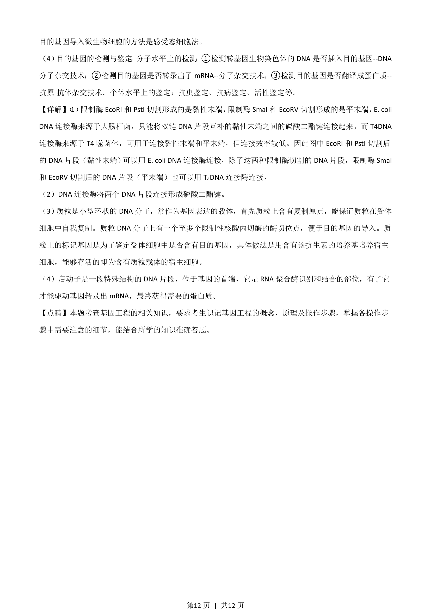

## 题面

## 摘要

考查DNA重组技术中限制酶、DNA连接酶及质粒载体的功能与应用。

## 关联考点

- [[411-基因工程|基因工程]]
- [[422-限制性核酸内切酶|限制酶]]
- [[409-DNA连接酶|DNA连接酶]]
- [[710-质粒载体|质粒载体]]

## 答案与解析

> 📄 原 PDF 第 11 页：`素材/真题/吉林/2008-2024·（吉林）生物高考真题/2021年高考生物试卷（全国乙卷）（解析卷）.pdf`
