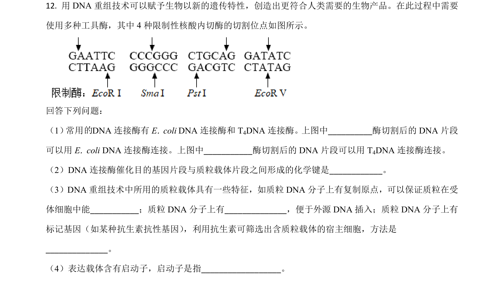
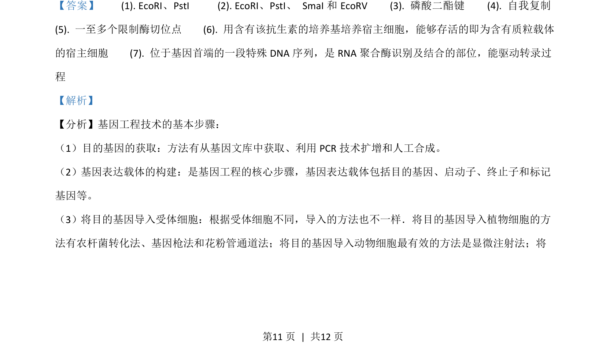
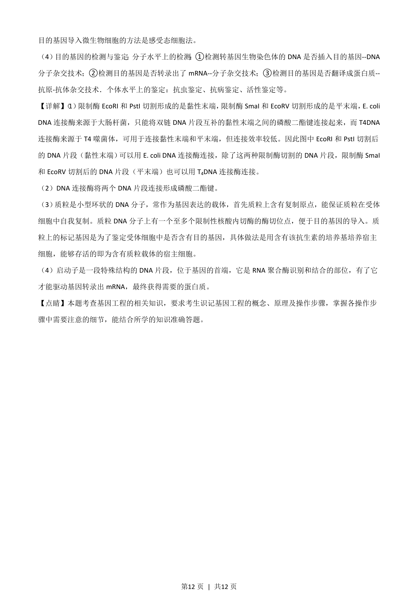

## 题面

## 摘要

考查DNA重组技术中限制酶、DNA连接酶及质粒载体的功能与应用。

## 关联考点

- [[411-基因工程|基因工程]]
- [[422-限制性核酸内切酶|限制酶]]
- [[409-DNA连接酶|DNA连接酶]]
- [[710-质粒载体|质粒载体]]

## 答案与解析

> 📄 原 PDF 第 11 页：`素材/真题/吉林/2008-2024·（吉林）生物高考真题/2021年高考生物试卷（全国乙卷）（解析卷）.pdf`

<!-- 题干文本-start -->
## 题干文本
12. 用 DNA 重组技术可以赋予生物以新的遗传特性，创造出更符合人类需要的生物产品。在此过程中需要
使用多种工具酶，其中 4 种限制性核酸内切酶的切割位点如图所示。
回答下列问题：
（1） 常用 DNA 连接酶有 E. coli DNA连接酶和 T4DNA 连接酶。上图中__________酶切割后的 DNA 片段
可以用 E. coli DNA连接酶连接。上图中___________酶切割后的 DNA 片段可以用 T4DNA 连接酶连接。
（2）DNA 连接酶催化目的基因片段与质粒载体片段之间形成的化学键是____________。
（3）DNA 重组技术中所用的质粒载体具有一些特征，如质粒 DNA 分子上有复制原点，可以保证质粒在受
体细胞中能___________；质粒 DNA 分子上有______________，便于外源 DNA 插入；质粒 DNA 分子上有
标记基因（如某种抗生素抗性基因） ，利用抗生素可筛选出含质粒载体的宿主细胞，方法是
______________。
（4）表达载体含有启动子，启动子是指__________________。
<!-- 题干文本-end -->

<!-- 解析文本-start -->
## 解析文本
【答案】    (1). EcoRI 、PstI     (2). EcoRI 、PstI、 SmaI 和 EcoRV    (3). 磷酸二酯键     (4). 自我复制    
(5). 一至多个限制酶切位点    (6). 用含有该抗生素的培养基培养宿主细胞，能够存活的即为含有质粒载体
的宿主细胞    (7). 位于基因首端的一段特殊 DNA序列，是 RNA聚合酶识别及结合的部位，能驱动转录过
程
【解析】
【分析】基因工程技术的基本步骤：
（1）目的基因的获取：方法有从基因文库中获取、利用 PCR技术扩增和人工合成。
（2）基因表达载体的构建：是基因工程的核心步骤，基因表达载体包括目的基因、启动子、终止子和标记
基因等。
（3）将目的基因导入受体细胞：根据受体细胞不同，导入的方法也不一样．将目的基因导入植物细胞的方
法有农杆菌转化法、基因枪法和花粉管通道法；将目的基因导入动物细胞最有效的方法是显微注射法；将
的
<!-- 解析文本-end -->
