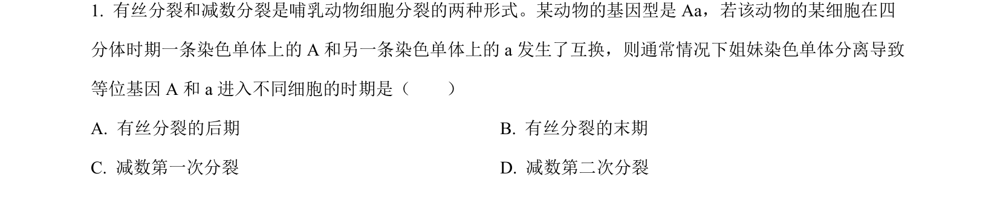
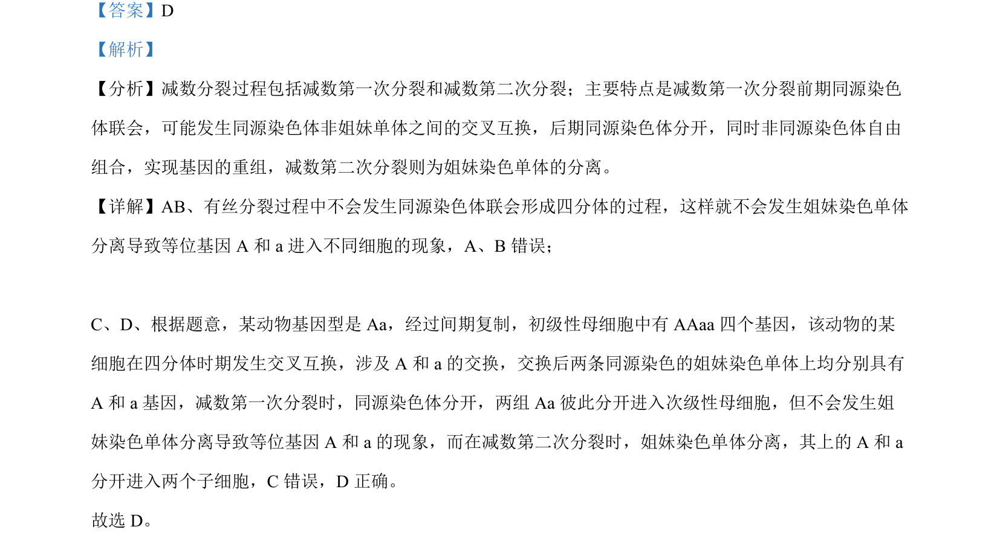

## 题面

## 摘要

该题考查减数分裂过程中交叉互换导致等位基因分离的时期判断。

## 关联考点

- [[277-减数分裂（高中必二）|减数分裂]]
- [[交叉互换]]
- [[等位基因分离]]
- [[姐妹染色单体]]

## 答案与解析

> 📄 原 PDF 第 1 页：`素材/真题/吉林/2008-2024·（吉林）生物高考真题/2022年高考生物试卷（全国乙卷）（解析卷）.pdf`
