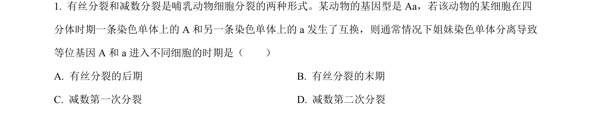
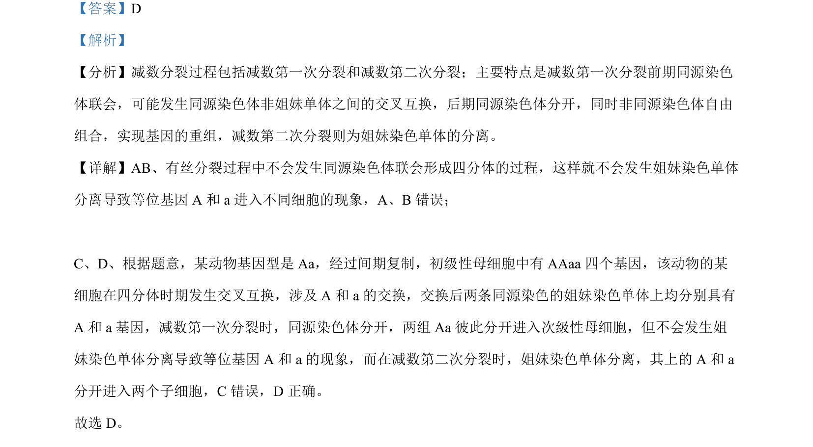

## 题面

## 摘要

该题考查减数分裂过程中交叉互换导致等位基因分离的时期判断。

## 关联考点

- [[277-减数分裂（高中必二）|减数分裂]]
- [[539-交叉互换|交叉互换]]
- [[672-等位基因分离|等位基因分离]]
- [[586-姐妹染色单体|姐妹染色单体]]

## 答案与解析

> 📄 原 PDF 第 1 页：`素材/真题/吉林/2008-2024·（吉林）生物高考真题/2022年高考生物试卷（全国乙卷）（解析卷）.pdf`

<!-- 题干文本-start -->
## 题干文本
1. 有丝分裂和减数分裂是哺乳动物细胞分裂的两种形式。某动物的基因型是 Aa，若该动物的某细胞在四
分体时期一条染色单体上的 A 和另一条染色单体上的 a发生了互换，则通常情况下姐妹染色单体分离导致
等位基因 A 和 a进入不同细胞的时期是（　　）
A. 有丝分裂的后期 B. 有丝分裂的末期
C. 减数第一次分裂 D. 减数第二次分裂
<!-- 题干文本-end -->

<!-- 解析文本-start -->
## 解析文本
【答案】D
【解析】
【分析】减数分裂过程包括减数第一次分裂和减数第二次分裂；主要特点是减数第一次分裂前期同源染色
体联会，可能发生同源染色体非姐妹单体之间的交叉互换，后期同源染色体分开，同时非同源染色体自由
组合，实现基因的重组，减数第二次分裂则为姐妹染色单体的分离。
【详解】AB、有丝分裂过程中不会发生同源染色体联会形成四分体的过程，这样就不会发生姐妹染色单体
分离导致等位基因 A 和 a进入不同细胞的现象，A、B错误；
C、D、根据题意，某动物基因型是 Aa，经过间期复制，初级性母细胞中有 AAaa四个基因，该动物的某
细胞在四分体时期发生交叉互换，涉及 A 和 a的交换，交换后两条同源染色的姐妹染色单体上均分别具有
A 和 a基因，减数第一次分裂时，同源染色体分开，两组 Aa彼此分开进入次级性母细胞，但不会发生姐
妹染色单体分离导致等位基因 A 和 a的现象，而在减数第二次分裂时，姐妹染色单体分离，其上的 A 和 a
分开进入两个子细胞，C错误，D 正确。
故选 D。
<!-- 解析文本-end -->
