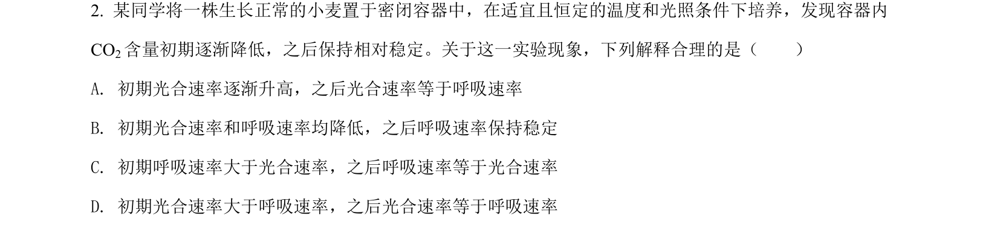
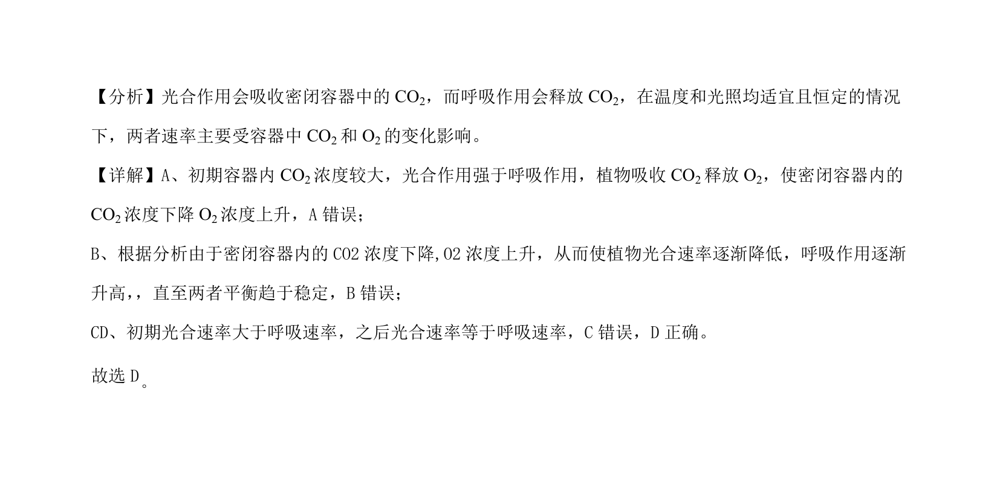

## 题面

## 摘要

光合作用与呼吸作用在密闭容器中的速率动态分析

## 关联考点

- [[033-光合作用|光合作用]]
- [[031-呼吸作用|呼吸作用]]
- [[622-气体浓度变化|气体浓度变化]]

## 答案与解析

> 📄 原 PDF 第 1 页：`素材/真题/吉林/2008-2024·（吉林）生物高考真题/2022年高考生物试卷（全国乙卷）（解析卷）.pdf`
