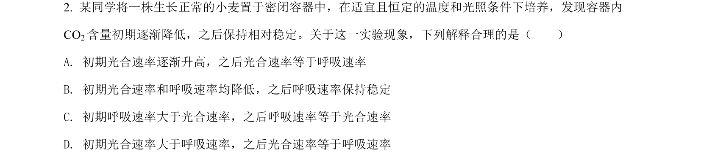
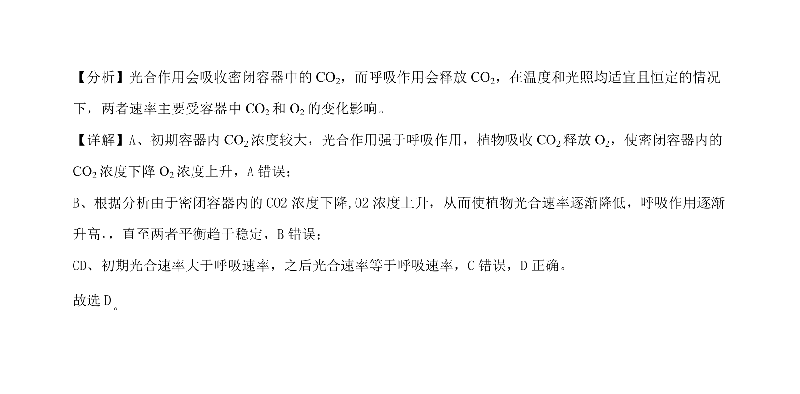

## 题面

## 摘要

光合作用与呼吸作用在密闭容器中的速率动态分析

## 关联考点

- [[033-光合作用|光合作用]]
- [[031-呼吸作用|呼吸作用]]
- [[622-气体浓度变化|气体浓度变化]]

## 答案与解析

> 📄 原 PDF 第 1 页：`素材/真题/吉林/2008-2024·（吉林）生物高考真题/2022年高考生物试卷（全国乙卷）（解析卷）.pdf`

<!-- 题干文本-start -->
## 题干文本
2. 某同学将一株生长正常的小麦置于密闭容器中，在适宜且恒定的温度和光照条件下培养，发现容器内
CO2含量初期逐渐降低，之后保持相对稳定。关于这一实验现象，下列解释合理的是（　　）
A. 初期光合速率逐渐升高，之后光合速率等于呼吸速率
B. 初期光合速率和呼吸速率均降低，之后呼吸速率保持稳定
C. 初期呼吸速率大于光合速率，之后呼吸速率等于光合速率
D. 初期光合速率大于呼吸速率，之后光合速率等于呼吸速率
<!-- 题干文本-end -->

<!-- 解析文本-start -->
## 解析文本
【答案】D
【解析】
<!-- 解析文本-end -->
