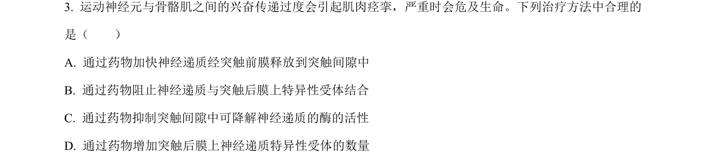
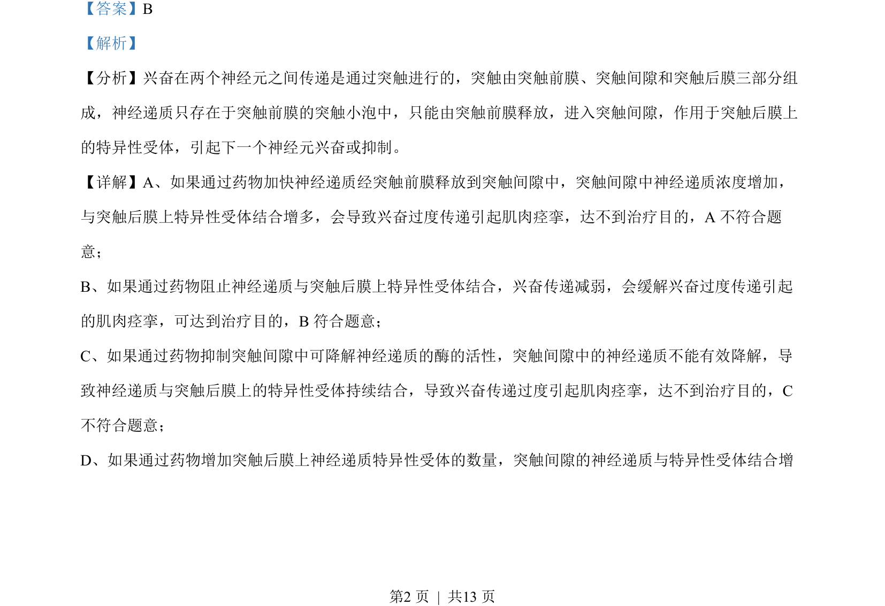
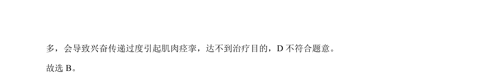

## 题面

## 摘要

本题通过药物对突触传递的影响，考查神经调节中兴奋传导与传递机制。

## 关联考点

- [[326-突触|突触]]
- [[325-神经递质|神经递质]]
- [[567-受体|受体]]
- [[549-兴奋传递|兴奋传递]]

## 答案与解析

> 📄 原 PDF 第 2 页：`素材/真题/吉林/2008-2024·（吉林）生物高考真题/2022年高考生物试卷（全国乙卷）（解析卷）.pdf`
