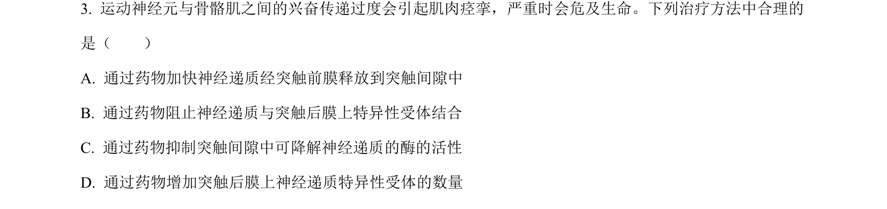
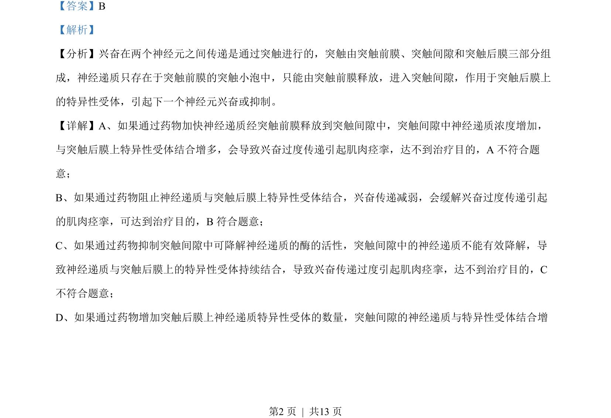

## 题面

## 摘要

本题通过药物对突触传递的影响，考查神经调节中兴奋传导与传递机制。

## 关联考点

- [[326-突触|突触]]
- [[325-神经递质|神经递质]]
- [[567-受体|受体]]
- [[549-兴奋传递|兴奋传递]]

## 答案与解析

> 📄 原 PDF 第 2 页：`素材/真题/吉林/2008-2024·（吉林）生物高考真题/2022年高考生物试卷（全国乙卷）（解析卷）.pdf`

<!-- 题干文本-start -->
## 题干文本
3. 运动神经元与骨骼肌之间的兴奋传递过度会引起肌肉痉挛，严重时会危及生命。下列治疗方法中合理的
是（　　）
A. 通过药物加快神经递质经突触前膜释放到突触间隙中
B. 通过药物阻止神经递质与突触后膜上特异性受体结合
C. 通过药物抑制突触间隙中可降解神经递质的酶的活性
D. 通过药物增加突触后膜上神经递质特异性受体的数量
<!-- 题干文本-end -->

<!-- 解析文本-start -->
## 解析文本
【答案】B
【解析】
【分析】兴奋在两个神经元之间传递是通过突触进行的，突触由突触前膜、突触间隙和突触后膜三部分组
成，神经递质只存在于突触前膜的突触小泡中，只能由突触前膜释放，进入突触间隙，作用于突触后膜上
的特异性受体，引起下一个神经元兴奋或抑制。
【详解】A、如果通过药物加快神经递质经突触前膜释放到突触间隙中，突触间隙中神经递质浓度增加，
与突触后膜上特异性受体结合增多，会导致兴奋过度传递引起肌肉痉挛，达不到治疗目的，A 不符合题
意；
B、如果通过药物阻止神经递质与突触后膜上特异性受体结合，兴奋传递减弱，会缓解兴奋过度传递引起
的肌肉痉挛，可达到治疗目的，B符合题意；
C、如果通过药物抑制突触间隙中可降解神经递质的酶的活性，突触间隙中的神经递质不能有效降解，导
致神经递质与突触后膜上的特异性受体持续结合，导致兴奋传递过度引起肌肉痉挛，达不到治疗目的，C
不符合题意；
D、如果通过药物增加突触后膜上神经递质特异性受体的数量，突触间隙的神经递质与特异性受体结合增
。
<!-- 解析文本-end -->
