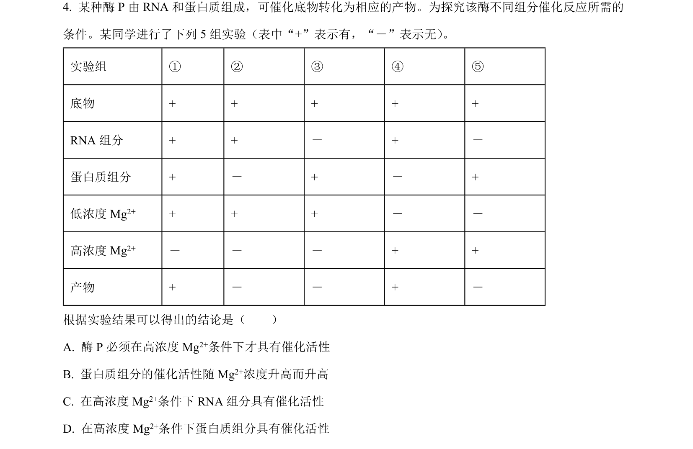
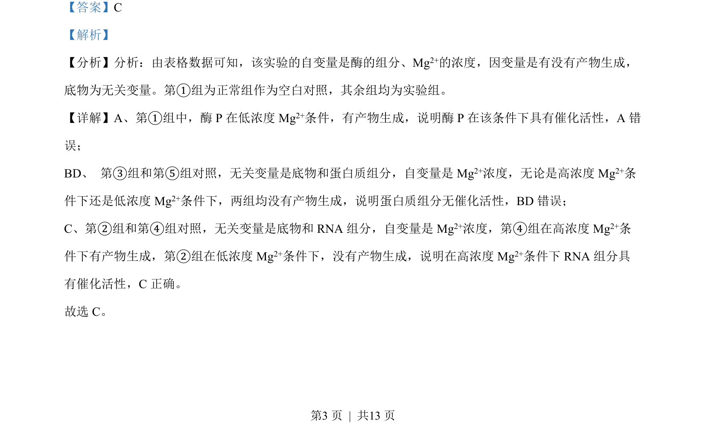

## 题面

## 摘要

题目通过对照实验分析酶 P 及其 RNA/蛋白质组分在不同 Mg²⁺浓度下的催化活性。

## 关联考点

- [[792-酶的催化活性|酶的催化活性]]
- [[480-实验变量分析|实验变量分析]]
- [[530-RNA 的催化功能|RNA 的催化功能]]

## 答案与解析

> 📄 原 PDF 第 3 页：`素材/真题/吉林/2008-2024·（吉林）生物高考真题/2022年高考生物试卷（全国乙卷）（解析卷）.pdf`
