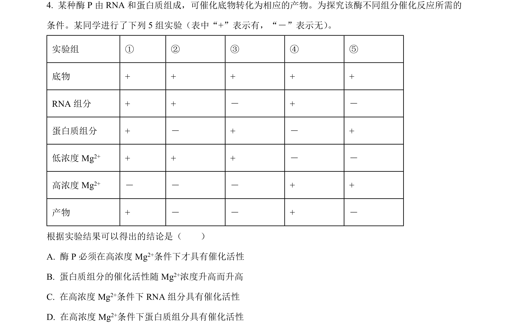
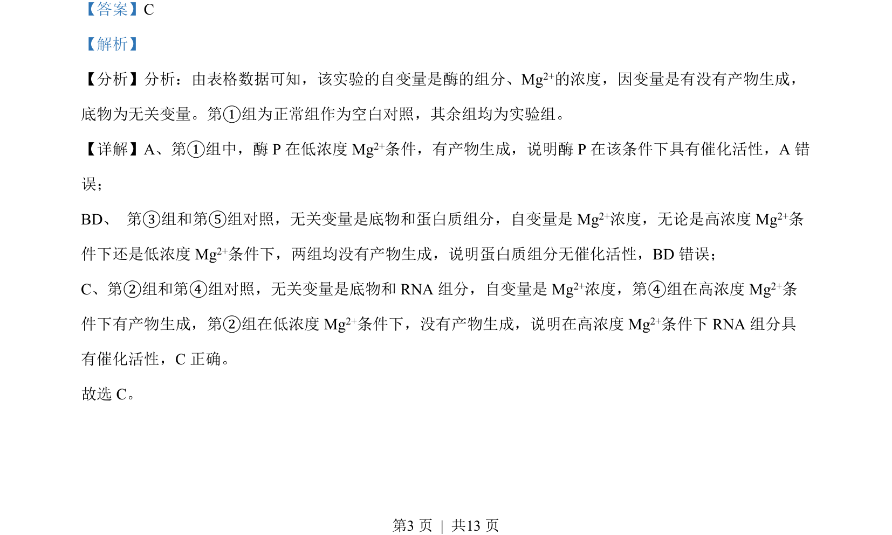

## 题面

## 摘要

题目通过对照实验分析酶 P 及其 RNA/蛋白质组分在不同 Mg²⁺浓度下的催化活性。

## 关联考点

- [[792-酶的催化活性|酶的催化活性]]
- [[480-实验变量分析|实验变量分析]]
- [[530-RNA 的催化功能|RNA 的催化功能]]

## 答案与解析

> 📄 原 PDF 第 3 页：`素材/真题/吉林/2008-2024·（吉林）生物高考真题/2022年高考生物试卷（全国乙卷）（解析卷）.pdf`

<!-- 题干文本-start -->
## 题干文本
4. 某种酶 P 由 RNA 和蛋白质组成，可催化底物转化为相应的产物。为探究该酶不同组分催化反应所需的
条件。某同学进行了下列 5 组实验（表中“+”表示有，“－”表示无） 。
实验组 ① ② ③ ④ ⑤
底物 + + + + +
RNA 组分 + + － + －
蛋白质组分 + － + － +
低浓度 Mg2+ + + + － －
高浓度 Mg2+ － － － + +
产物 + － － + －
根据实验结果可以得出的结论是（　　）
A. 酶 P 必须在高浓度 Mg2+条件下才具有催化活性
B. 蛋白质组分的催化活性随 Mg2+浓度升高而升高
C. 在高浓度 Mg2+条件下 RNA 组分具有催化活性
D. 在高浓度 Mg2+条件下蛋白质组分具有催化活性
<!-- 题干文本-end -->

<!-- 解析文本-start -->
## 解析文本
【答案】C
【解析】
【分析】分析：由表格数据可知，该实验的自变量是酶的组分、Mg2+的浓度，因变量是有没有产物生成，
底物为无关变量。第①组为正常组作为空白对照，其余组均为实验组。
【详解】A、第①组中，酶 P 在低浓度 Mg2+条件，有产物生成，说明酶 P 在该条件下具有催化活性，A 错
误；
BD、 第③组和第⑤组对照，无关变量是底物和蛋白质组分，自变量是 Mg2+浓度，无论是高浓度 Mg2+条
件下还是低浓度 Mg2+条件下，两组均没有产物生成，说明蛋白质组分无催化活性，BD 错误；
C、第②组和第④组对照，无关变量是底物和 RNA 组分，自变量是 Mg2+浓度，第④组在高浓度 Mg2+条
件下有产物生成，第②组在低浓度 Mg2+条件下，没有产物生成，说明在高浓度 Mg2+条件下 RNA 组分具
有催化活性，C正确。
故选 C。
<!-- 解析文本-end -->
