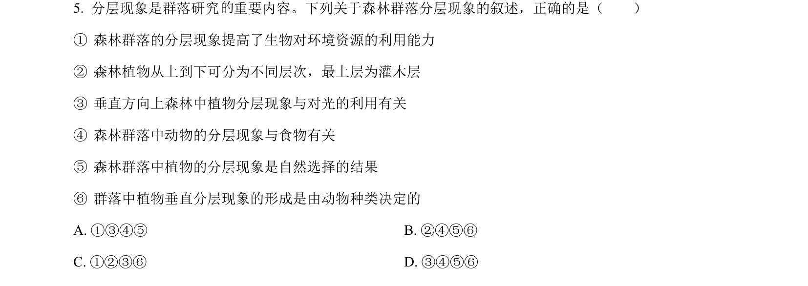
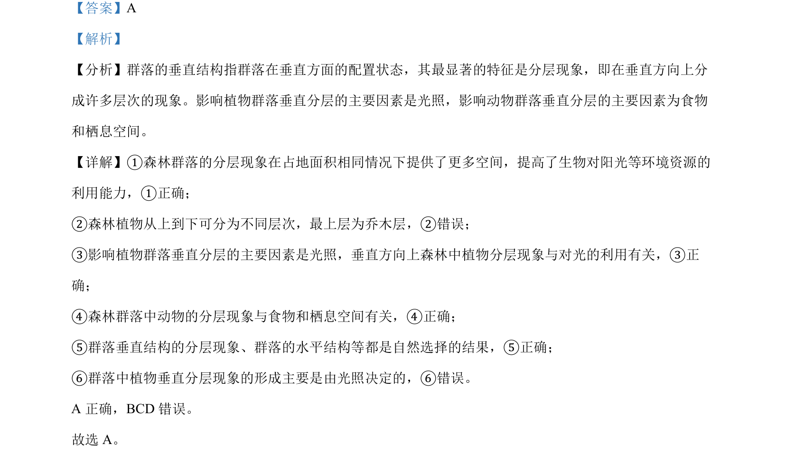

## 题面

## 摘要

本题考查生物群落垂直结构相关表述正误判断，涉及植物和动物分层现象及影响因素。

## 关联考点

- [[375-群落垂直结构|群落垂直结构]]
- [[554-分层现象|分层现象]]
- [[019-生态因素|生态因素]]
- [[184-自然选择|自然选择]]

## 答案与解析

> 📄 原 PDF 第 4 页：`素材/真题/吉林/2008-2024·（吉林）生物高考真题/2022年高考生物试卷（全国乙卷）（解析卷）.pdf`
