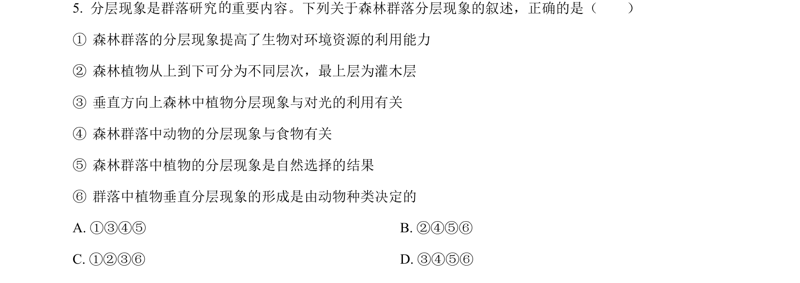
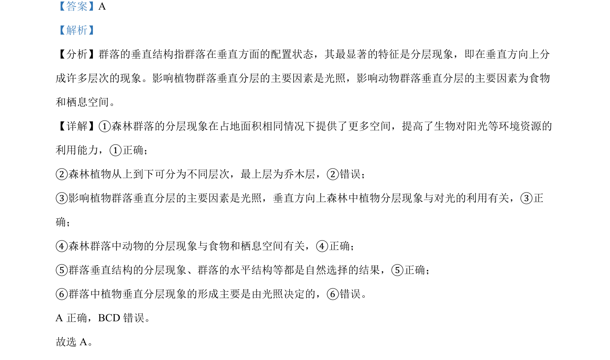

## 题面

## 摘要

本题考查生物群落垂直结构相关表述正误判断，涉及植物和动物分层现象及影响因素。

## 关联考点

- [[375-群落垂直结构|群落垂直结构]]
- [[554-分层现象|分层现象]]
- [[019-生态因素|生态因素]]
- [[184-自然选择|自然选择]]

## 答案与解析

> 📄 原 PDF 第 4 页：`素材/真题/吉林/2008-2024·（吉林）生物高考真题/2022年高考生物试卷（全国乙卷）（解析卷）.pdf`

<!-- 题干文本-start -->
## 题干文本
5. 分层现象是群落研究 重要内容。下列关于森林群落分层现象的叙述，正确的是（　　）
① 森林群落的分层现象提高了生物对环境资源的利用能力
② 森林植物从上到下可分为不同层次，最上层为灌木层
③ 垂直方向上森林中植物分层现象与对光的利用有关
④ 森林群落中动物的分层现象与食物有关
⑤ 森林群落中植物的分层现象是自然选择的结果
⑥ 群落中植物垂直分层现象的形成是由动物种类决定的
A. ①③④⑤ B. ②④⑤⑥
C. ①②③⑥ D. ③④⑤⑥
<!-- 题干文本-end -->

<!-- 解析文本-start -->
## 解析文本
【答案】A
【解析】
【分析】群落的垂直结构指群落在垂直方面的配置状态，其最显著的特征是分层现象，即在垂直方向上分
成许多层次的现象。影响植物群落垂直分层的主要因素是光照，影响动物群落垂直分层的主要因素为食物
和栖息空间。
【详解】①森林群落的分层现象在占地面积相同情况下提供了更多空间，提高了生物对阳光等环境资源的
利用能力，①正确；
②森林植物从上到下可分为不同层次，最上层为乔木层，②错误；
③影响植物群落垂直分层的主要因素是光照，垂直方向上森林中植物分层现象与对光的利用有关，③正
确；
④森林群落中动物的分层现象与食物和栖息空间有关，④正确；
⑤群落垂直结构的分层现象、群落的水平结构等都是自然选择的结果，⑤正确；
⑥群落中植物垂直分层现象的形成主要是由光照决定的，⑥错误。
A 正确，BCD 错误。
故选 A。
<!-- 解析文本-end -->
