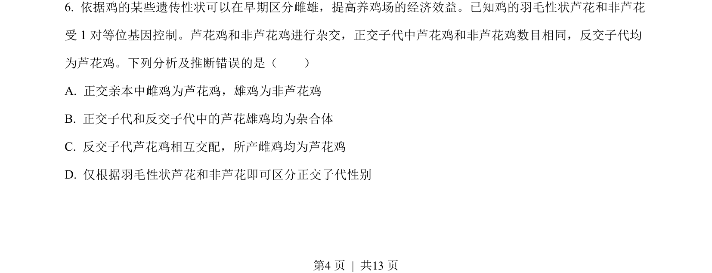
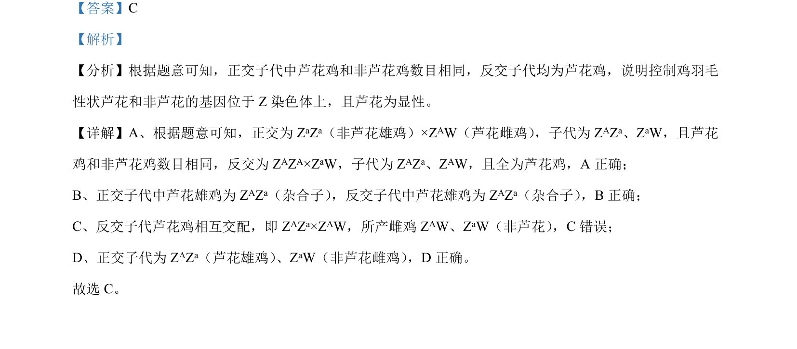

## 题面

## 摘要

该题通过正交与反交实验，考查鸡羽毛性状的伴性遗传方式及基因型推断。

## 关联考点

- [[276-伴性遗传|伴性遗传]]
- [[534-ZW型性别决定|ZW型性别决定]]
- [[578-基因显隐性|基因显隐性]]
- [[492-杂交实验|杂交实验]]

## 答案与解析

> 📄 原 PDF 第 4 页：`素材/真题/吉林/2008-2024·（吉林）生物高考真题/2022年高考生物试卷（全国乙卷）（解析卷）.pdf`
