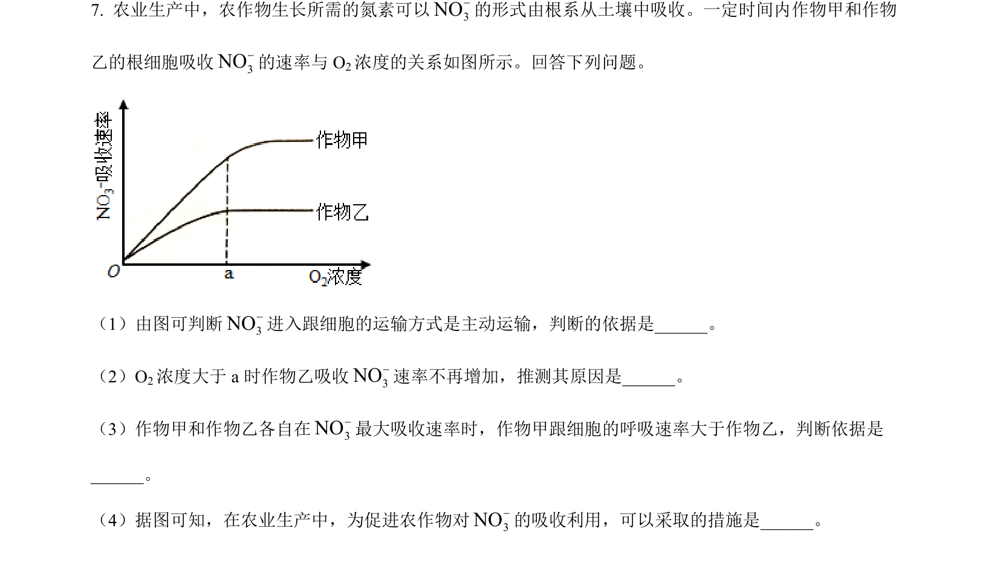
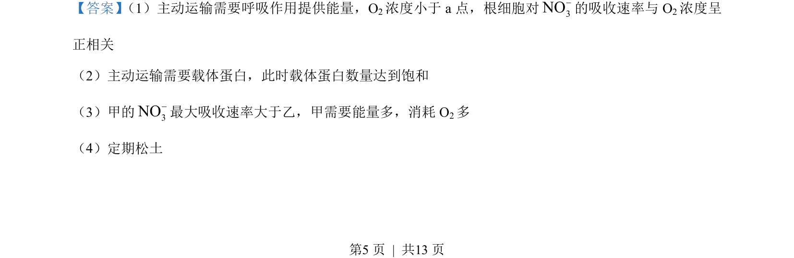
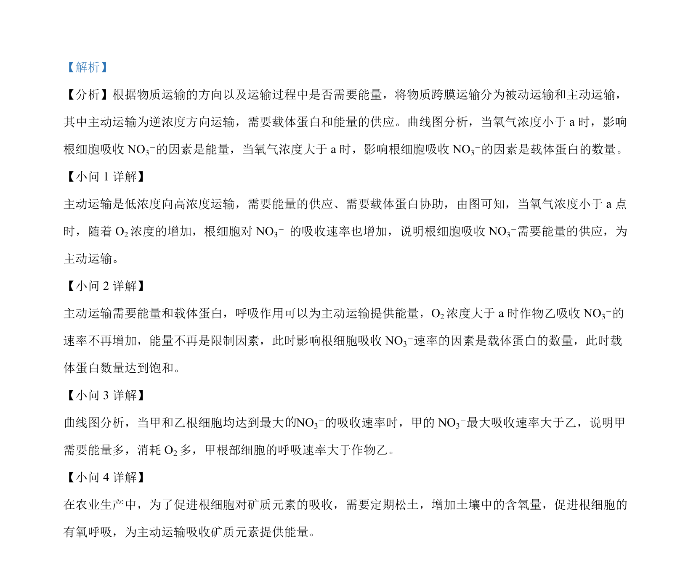

## 题面

## 摘要

该题考查氧气浓度对根细胞通过主动运输吸收硝酸根离子的影响及其限制因素。

## 关联考点

- [[256-主动运输|主动运输]]
- [[763-载体蛋白|载体蛋白]]
- [[240-有氧呼吸|有氧呼吸]]
- [[659-矿质元素吸收|矿质元素吸收]]

## 答案与解析

> 📄 原 PDF 第 5 页：`素材/真题/吉林/2008-2024·（吉林）生物高考真题/2022年高考生物试卷（全国乙卷）（解析卷）.pdf`

<!-- 题干文本-start -->
## 题干文本
7. 农业生产中，农作物生长所需的氮素可以3NO-的形式由根系从土壤中吸收。一定时间内作物甲和作物
乙的根细胞吸收3NO-的速率与 O2浓度的关系如图所示。回答下列问题。
（1）由图可判断3NO-进入跟细胞的运输方式是主动运输，判断的依据是______。
（2）O2浓度大于 a时作物乙吸收3NO-速率不再增加，推测其原因是______。
（3）作物甲和作物乙各自在3NO-最大吸收速率时，作物甲跟细胞的呼吸速率大于作物乙，判断依据是
______。
（4）据图可知，在农业生产中，为促进农作物对3NO-的吸收利用，可以采取的措施是______。
<!-- 题干文本-end -->

<!-- 解析文本-start -->
## 解析文本
【答案】 （1）主动运输需要呼吸作用提供能量，O2浓度小于 a 点，根细胞对3NO-的吸收速率与 O2浓度呈
正相关    
（2）主动运输需要载体蛋白，此时载体蛋白数量达到饱和    
（3）甲的3NO-最大吸收速率大于乙，甲需要能量多，消耗 O2多    
（4）定期松土
<!-- 解析文本-end -->
