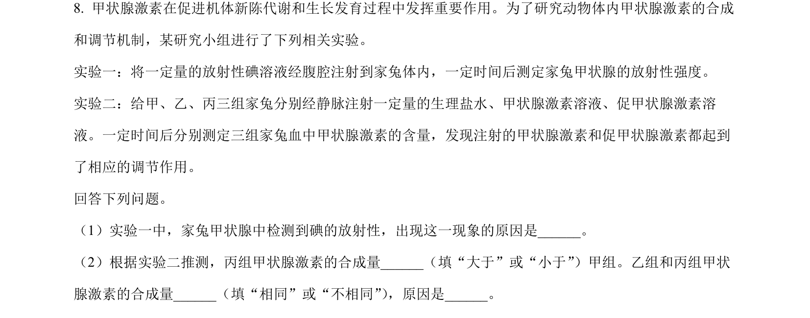
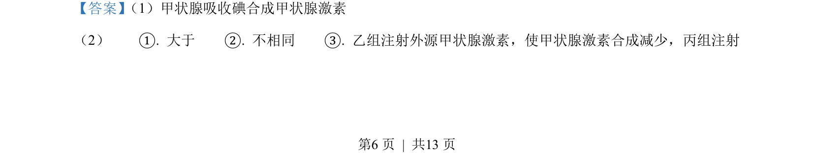

## 题面

## 摘要

本题考查甲状腺激素的合成与反馈调节，通过放射性碘标记分析激素分泌及外界激素/促激素的影响。

## 关联考点

- [[330-体液调节|体液调节]]
- [[334-反馈调节|反馈调节]]
- [[实验设计]]
- [[碘代谢]]

## 答案与解析

> 📄 原 PDF 第 6 页：`素材/真题/吉林/2008-2024·（吉林）生物高考真题/2022年高考生物试卷（全国乙卷）（解析卷）.pdf`
