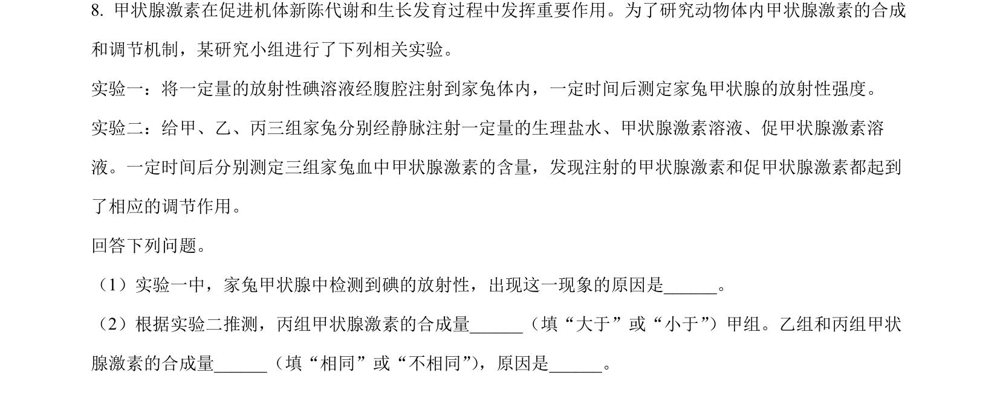
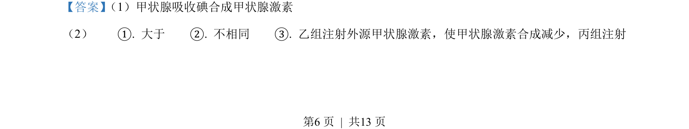
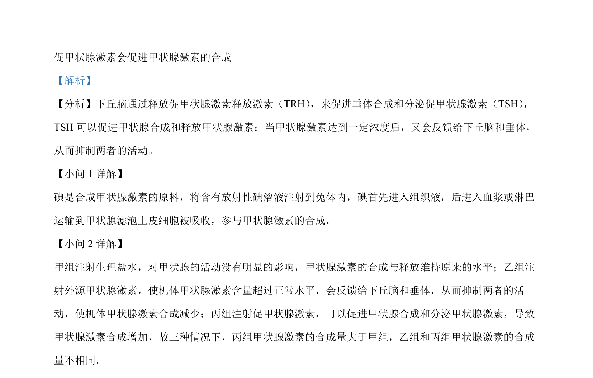

## 题面

## 摘要

本题考查甲状腺激素的合成与反馈调节，通过放射性碘标记分析激素分泌及外界激素/促激素的影响。

## 关联考点

- [[330-体液调节|体液调节]]
- [[334-反馈调节|反馈调节]]
- [[482-实验设计|实验设计]]
- [[660-碘代谢|碘代谢]]

## 答案与解析

> 📄 原 PDF 第 6 页：`素材/真题/吉林/2008-2024·（吉林）生物高考真题/2022年高考生物试卷（全国乙卷）（解析卷）.pdf`

<!-- 题干文本-start -->
## 题干文本
8. 甲状腺激素在促进机体新陈代谢和生长发育过程中发挥重要作用。为了研究动物体内甲状腺激素的合成
和调节机制，某研究小组进行了下列相关实验。
实验一：将一定量的放射性碘溶液经腹腔注射到家兔体内，一定时间后测定家兔甲状腺的放射性强度。
实验二：给甲、乙、丙三组家兔分别经静脉注射一定量的生理盐水、甲状腺激素溶液、促甲状腺激素溶
液。一定时间后分别测定三组家兔血中甲状腺激素的含量，发现注射的甲状腺激素和促甲状腺激素都起到
了相应的调节作用。
回答下列问题。
（1）实验一中，家兔甲状腺中检测到碘的放射性，出现这一现象的原因是______。
（2）根据实验二推测，丙组甲状腺激素的合成量______（填“大于”或“小于”）甲组。乙组和丙组甲状
腺激素的合成量______（填“相同”或“不相同”） ，原因是______。
<!-- 题干文本-end -->

<!-- 解析文本-start -->
## 解析文本
【答案】 （1）甲状腺吸收碘合成甲状腺激素    
（2）    ①. 大于    ②. 不相同    ③. 乙组注射外源甲状腺激素，使甲状腺激素合成减少，丙组注射
的
<!-- 解析文本-end -->
