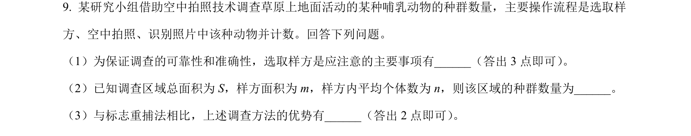
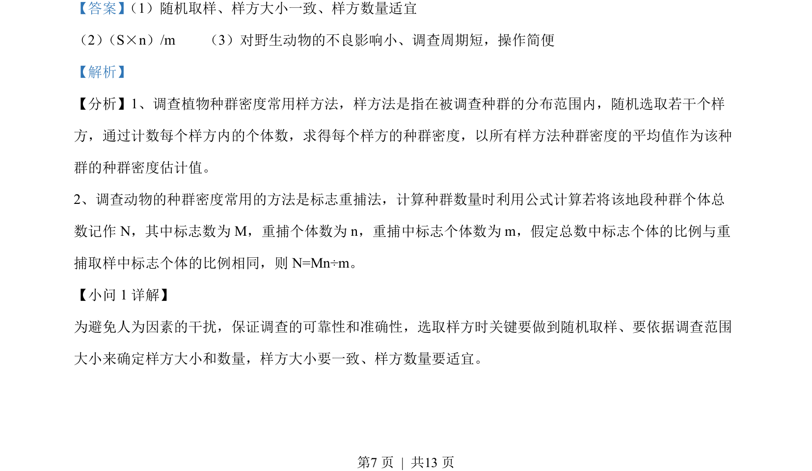
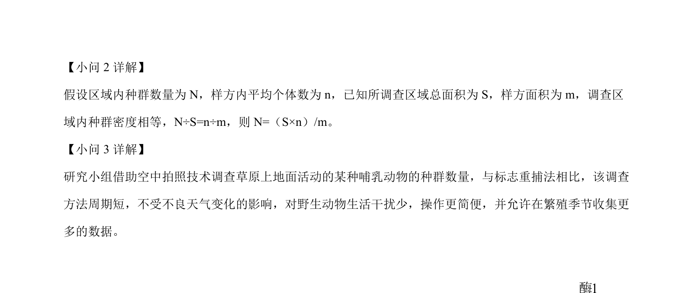

## 题面

## 摘要

利用空中拍照和样方法调查草原哺乳动物种群数量，考查样方选取要点、种群密度估算公式及与标志重捕法的比较。

## 关联考点

- [[370-种群密度|种群密度]]
- [[366-样方法|样方法]]
- [[365-标志重捕法|标志重捕法]]
- [[781-种群数量调查|种群数量调查]]

## 答案与解析

> 📄 原 PDF 第 7 页：`素材/真题/吉林/2008-2024·（吉林）生物高考真题/2022年高考生物试卷（全国乙卷）（解析卷）.pdf`

<!-- 题干文本-start -->
## 题干文本
9. 某研究小组借助空中拍照技术调查草原上地面活动的某种哺乳动物的种群数量，主要操作流程是选取样
方、空中拍照、识别照片中该种动物并计数。回答下列问题。
（1）为保证调查的可靠性和准确性，选取样方是应注意的主要事项有______（答出 3 点即可） 。
（2）已知调查区域总面积为 S，样方面积为 m，样方内平均个体数为 n，则该区域的种群数量为______。
（3）与标志重捕法相比，上述调查方法的优势有______（答出 2 点即可） 。
<!-- 题干文本-end -->

<!-- 解析文本-start -->
## 解析文本
【答案】 （1）随机取样、样方大小一致、样方数量适宜    
（2） （S×n）/m    （3）对野生动物的不良影响小、调查周期短，操作简便
【解析】
【分析】1、调查植物种群密度常用样方法，样方法是指在被调查种群的分布范围内，随机选取若干个样
方，通过计数每个样方内的个体数，求得每个样方的种群密度，以所有样方法种群密度的平均值作为该种
群的种群密度估计值。
2、调查动物的种群密度常用的方法是标志重捕法，计算种群数量时利用公式计算若将该地段种群个体总
数记作 N，其中标志数为 M，重捕个体数为 n，重捕中标志个体数为 m，假定总数中标志个体的比例与重
捕取样中标志个体的比例相同，则 N=Mn÷m。
【小问 1 详解】
为避免人为因素的干扰，保证调查的可靠性和准确性，选取样方时关键要做到随机取样、要依据调查范围
大小来确定样方大小和数量，样方大小要一致、样方数量要适宜。
<!-- 解析文本-end -->
