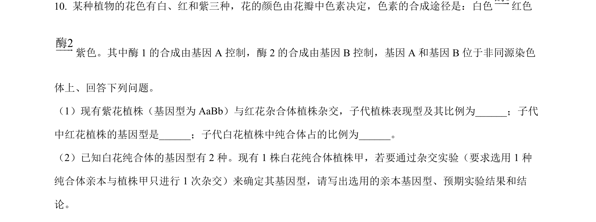
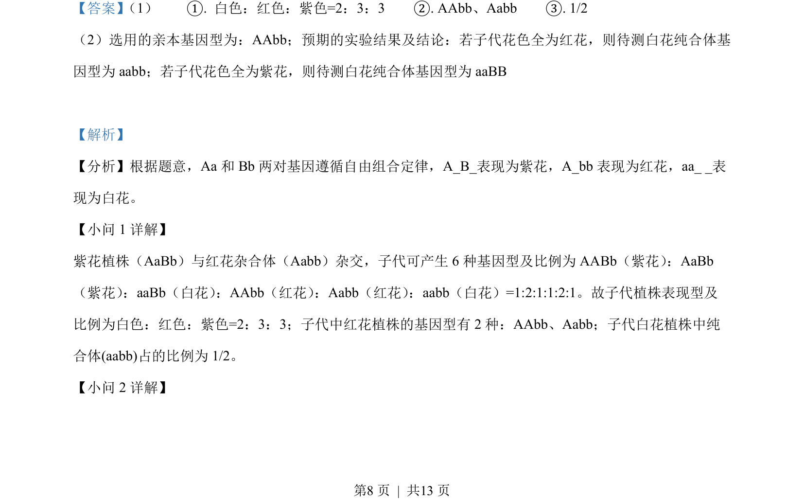
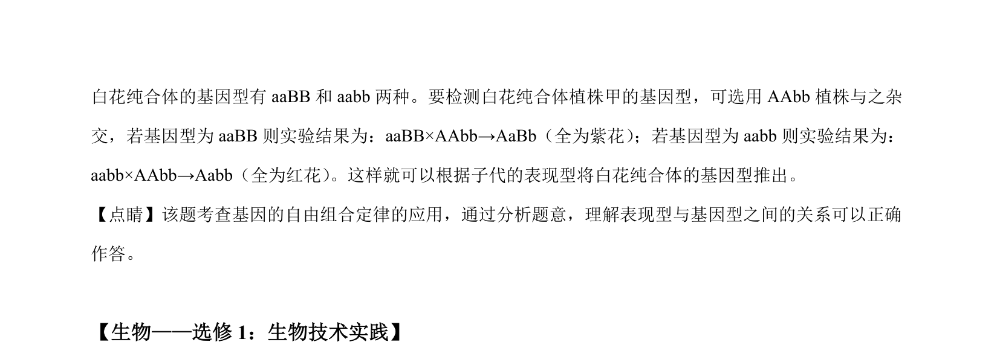

## 题面

## 摘要

本题通过花色遗传的基因互作，考查自由组合定律的应用及杂交实验设计，要求推断子代表现型比例、基因型及纯合体鉴定。

## 关联考点

- [[272-自由组合定律|自由组合定律]]
- [[573-基因互作|基因互作]]
- [[515-遗传杂交实验设计|遗传杂交实验设计]]
- [[949-概率计算|概率计算]]

## 答案与解析

> 📄 原 PDF 第 8 页：`素材/真题/吉林/2008-2024·（吉林）生物高考真题/2022年高考生物试卷（全国乙卷）（解析卷）.pdf`
