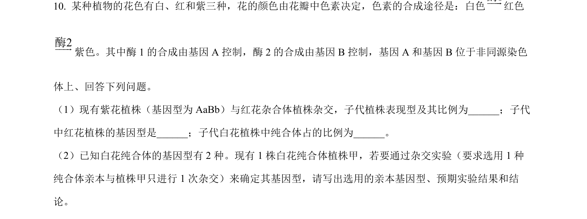
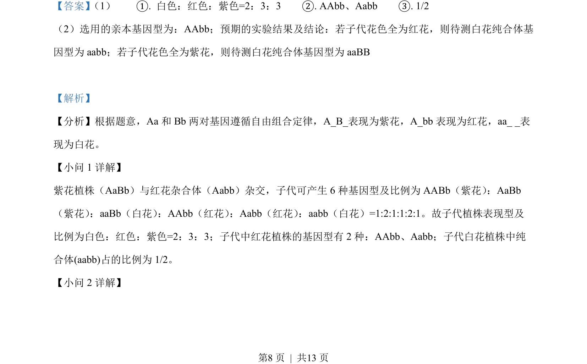
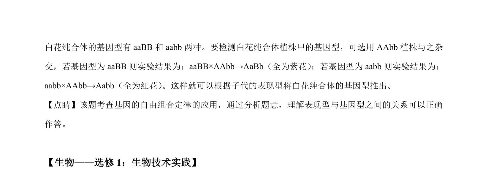

## 题面

## 摘要

本题通过花色遗传的基因互作，考查自由组合定律的应用及杂交实验设计，要求推断子代表现型比例、基因型及纯合体鉴定。

## 关联考点

- [[272-自由组合定律|自由组合定律]]
- [[573-基因互作|基因互作]]
- [[515-遗传杂交实验设计|遗传杂交实验设计]]
- [[948-概率计算|概率计算]]

## 答案与解析

> 📄 原 PDF 第 8 页：`素材/真题/吉林/2008-2024·（吉林）生物高考真题/2022年高考生物试卷（全国乙卷）（解析卷）.pdf`

<!-- 题干文本-start -->
## 题干文本
10. 某种植物的花色有白、红和紫三种，花的颜色由花瓣中色素决定，色素的合成途径是：白色
1uuu r酶
红色
2uuur酶
紫色。其中酶 1 的合成由基因 A 控制，酶 2 的合成由基因 B控制，基因 A 和基因 B位于非同源染色
体上、回答下列问题。
（1）现有紫花植株（基因型为 AaBb）与红花杂合体植株杂交，子代植株表现型及其比例为______；子代
中红花植株的基因型是______；子代白花植株中纯合体占的比例为______。
（2）已知白花纯合体的基因型有 2 种。现有 1 株白花纯合体植株甲，若要通过杂交实验（要求选用 1 种
纯合体亲本与植株甲只进行 1 次杂交）来确定其基因型，请写出选用的亲本基因型、预期实验结果和结
论。
<!-- 题干文本-end -->

<!-- 解析文本-start -->
## 解析文本
【答案】 （1）    ①. 白色：红色：紫色=2：3：3    ②. AAbb、Aabb    ③. 1/2    
（2）选用的亲本基因型为：AAbb；预期的实验结果及结论：若子代花色全为红花，则待测白花纯合体基
因型为 aabb；若子代花色全为紫花，则待测白花纯合体基因型为 aaBB
【解析】
【分析】根据题意，Aa和 Bb两对基因遵循自由组合定律，A_B_表现为紫花，A_bb 表现为红花，aa_ _表
现为白花。
【小问 1 详解】
紫花植株（AaBb）与红花杂合体（Aabb）杂交，子代可产生 6 种基因型及比例为 AABb（紫花） ：AaBb
（紫花） ：aaBb（白花） ：AAbb（红花） ：Aabb（红花） ：aabb（白花）=1:2:1:1:2:1。故子代植株表现型及
比例为白色：红色：紫色=2：3：3；子代中红花植株的基因型有 2 种：AAbb、Aabb；子代白花植株中纯
合体(aabb)占的比例为 1/2。
【小问 2 详解】
<!-- 解析文本-end -->
