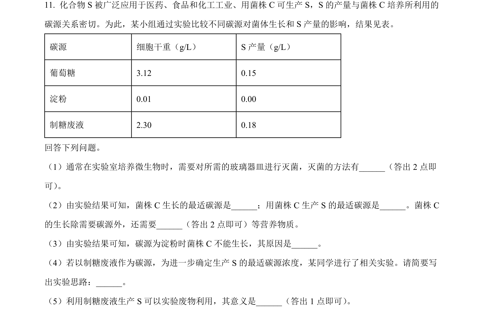
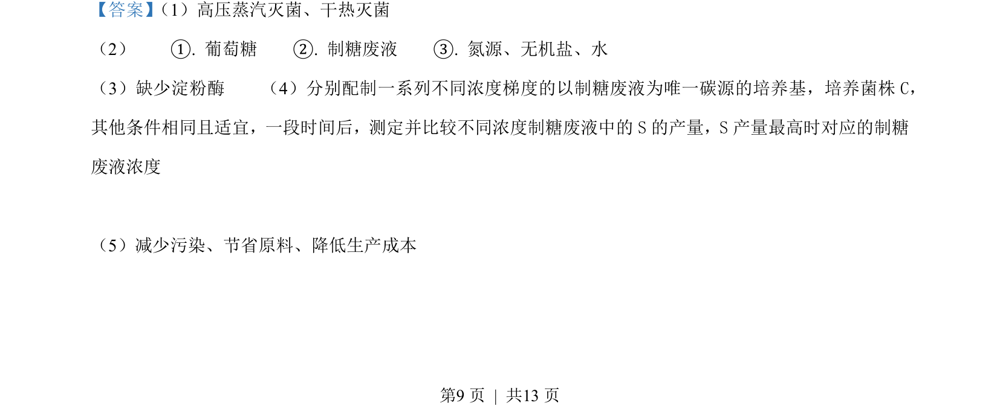
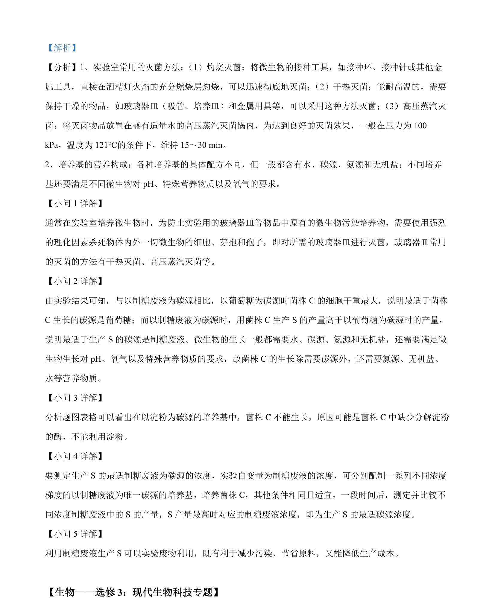

## 题面

## 摘要

考查微生物培养中碳源对菌体生长和产物合成的影响及实验设计

## 关联考点

- [[428-微生物培养|微生物培养]]
- [[661-碳源|碳源]]
- [[427-培养基|选择培养基]]
- [[482-实验设计|实验设计]]

## 答案与解析

> 📄 原 PDF 第 9 页：`素材/真题/吉林/2008-2024·（吉林）生物高考真题/2022年高考生物试卷（全国乙卷）（解析卷）.pdf`

<!-- 题干文本-start -->
## 题干文本
11. 化合物 S 被广泛应用于医药、食品和化工工业、用菌株 C可生产 S，S 的产量与菌株 C培养所利用的
碳源关系密切。为此，某小组通过实验比较不同碳源对菌体生长和 S 产量的影响，结果见表。
碳源 细胞干重（g/L） S 产量（g/L）
葡萄糖 3.12 0.15
淀粉 0.01 0.00
制糖废液 2.30 0.18
回答下列问题。
（1）通常在实验室培养微生物时，需要对所需的玻璃器皿进行灭菌，灭菌的方法有______（答出 2 点即
可） 。
（2）由实验结果可知，菌株 C生长的最适碳源是______；用菌株 C生产 S 的最适碳源是______。菌株 C
的生长除需要碳源外，还需要______（答出 2 点即可）等营养物质。
（3）由实验结果可知，碳源为淀粉时菌株 C不能生长，其原因是______。
（4）若以制糖废液作为碳源，为进一步确定生产 S 的最适碳源浓度，某同学进行了相关实验。请简要写
出实验思路：______。
（5）利用制糖废液生产 S 可以实验废物利用，其意义是______（答出 1 点即可） 。
<!-- 题干文本-end -->

<!-- 解析文本-start -->
## 解析文本
【答案】 （1）高压蒸汽灭菌、干热灭菌    
（2）    ①. 葡萄糖    ②. 制糖废液    ③. 氮源、无机盐、水    
（3）缺少淀粉酶    （4）分别配制一系列不同浓度梯度的以制糖废液为唯一碳源的培养基，培养菌株C，
其他条件相同且适宜，一段时间后，测定并比较不同浓度制糖废液中的S的产量，S产量最高时对应的制糖
废液浓度
    
（5）减少污染、节省原料、降低生产成本
<!-- 解析文本-end -->
