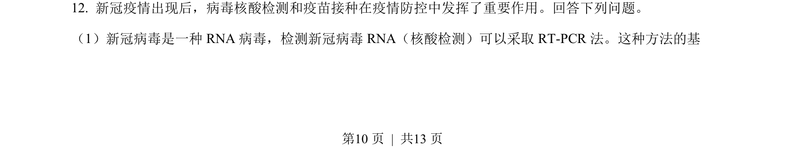
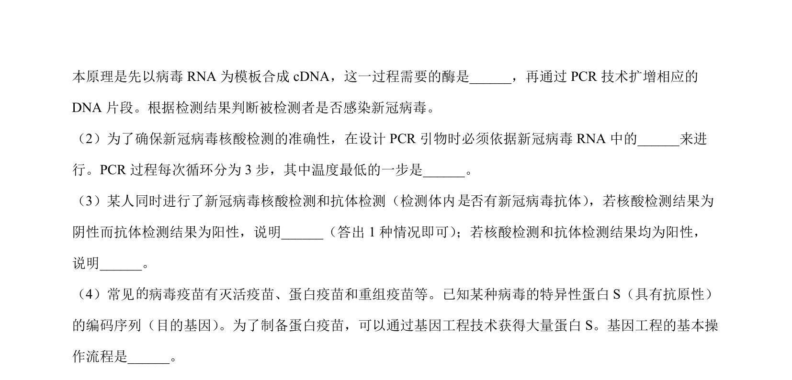
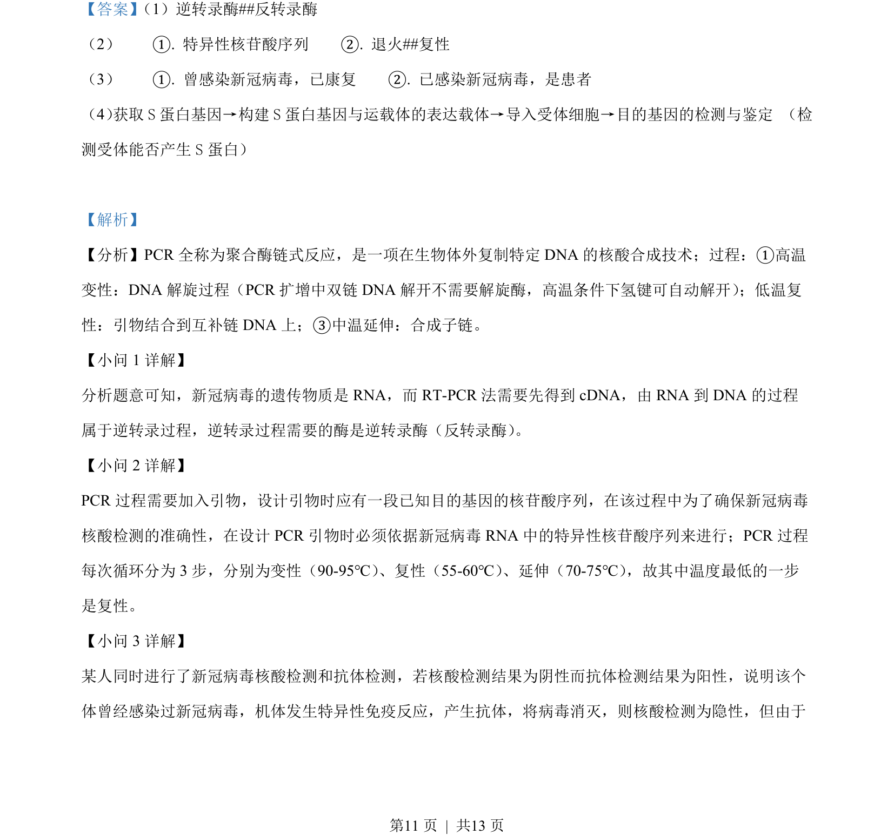
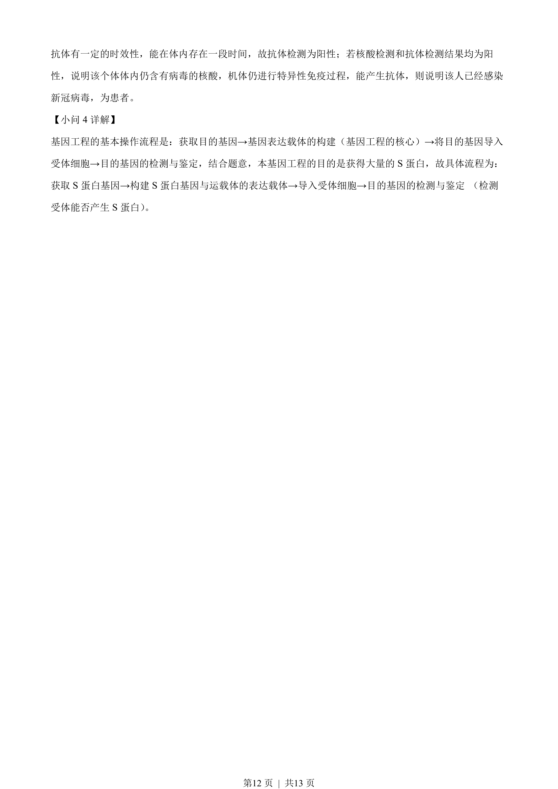

## 题面

## 摘要

新冠病毒核酸检测采用RT-PCR方法的原理与步骤

## 关联考点

- [[801-RNA病毒|RNA病毒]]
- [[494-核酸检测|核酸检测]]
- [[746-RT-PCR|RT-PCR]]
- [[513-逆转录|逆转录]]

## 答案与解析

> 📄 原 PDF 第 10 页：`素材/真题/吉林/2008-2024·（吉林）生物高考真题/2022年高考生物试卷（全国乙卷）（解析卷）.pdf`
