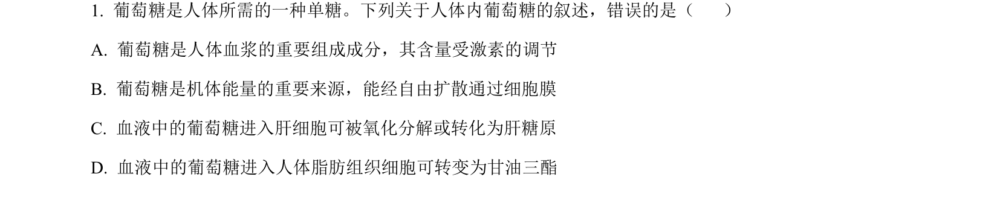
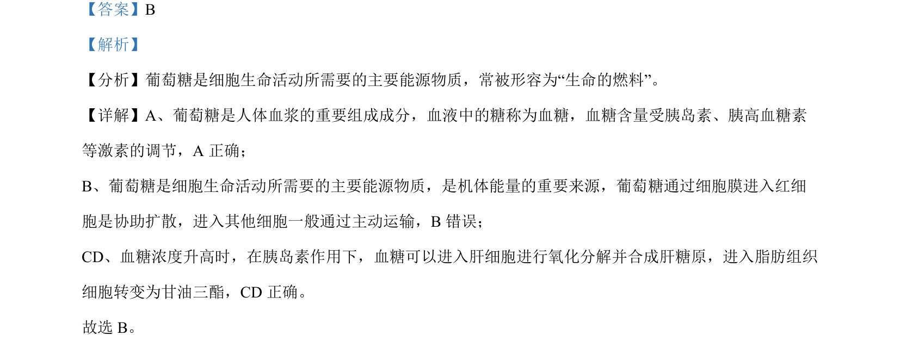

## 题面

## 摘要

本题为生物题，考查葡萄糖在人体内的运输方式及代谢过程。

## 关联考点

- [[635-物质跨膜运输|物质跨膜运输]]
- [[673-糖类代谢|糖类代谢]]

## 答案与解析

> 📄 原 PDF 第 1 页：`素材/真题/吉林/2008-2024·（吉林）生物高考真题/2023年高考生物试卷（新课标）（解析卷）.pdf`

<!-- 题干文本-start -->
## 题干文本
1. 葡萄糖是人体所需的一种单糖。下列关于人体内葡萄糖的叙述，错误的是（    ）
A. 葡萄糖是人体血浆的重要组成成分，其含量受激素的调节
B. 葡萄糖是机体能量的重要来源，能经自由扩散通过细胞膜
C. 血液中的葡萄糖进入肝细胞可被氧化分解或转化为肝糖原
D. 血液中的葡萄糖进入人体脂肪组织细胞可转变为甘油三酯
<!-- 题干文本-end -->

<!-- 解析文本-start -->
## 解析文本
【答案】B
【解析】
【分析】葡萄糖是细胞生命活动所需要的主要能源物质，常被形容为“生命的燃料”。
【详解】A、葡萄糖是人体血浆的重要组成成分，血液中的糖称为血糖，血糖含量受胰岛素、胰高血糖素
等激素的调节，A 正确；
B、葡萄糖是细胞生命活动所需要的主要能源物质，是机体能量的重要来源，葡萄糖通过细胞膜进入红细
胞是协助扩散，进入其他细胞一般通过主动运输，B错误；
CD、血糖浓度升高时，在胰岛素作用下，血糖可以进入肝细胞进行氧化分解并合成肝糖原，进入脂肪组织
细胞转变为甘油三酯，CD 正确。
故选 B。
<!-- 解析文本-end -->
