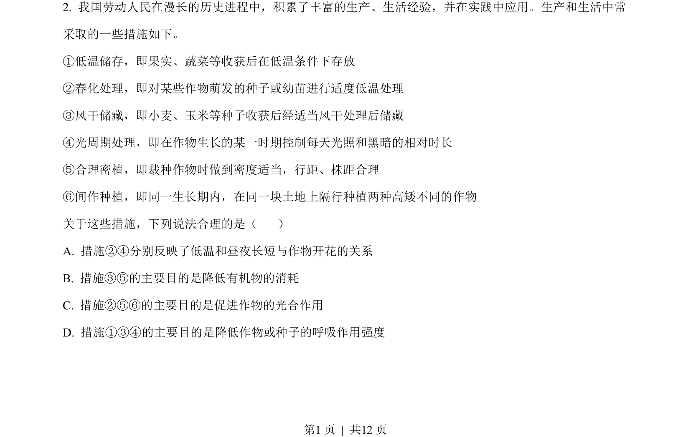
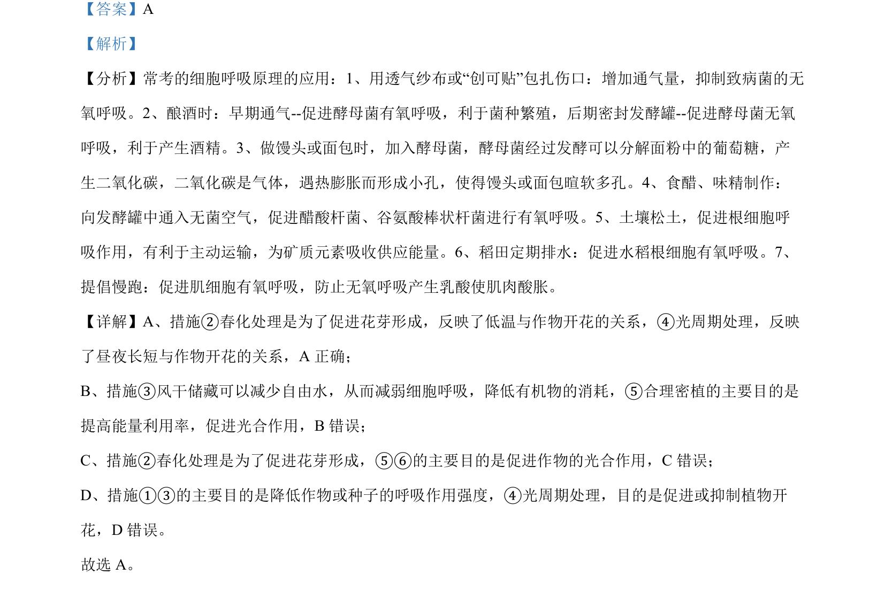

## 题面

## 摘要

农业生产措施与生物学原理的对应，涉及温度、光照对植物开花和代谢的影响

## 关联考点

- [[761-春化作用|春化作用]]
- [[760-光周期|光周期]]
- [[241-细胞呼吸|细胞呼吸]]
- [[033-光合作用|光合作用]]

## 答案与解析

> 📄 原 PDF 第 1 页：`素材/真题/吉林/2008-2024·（吉林）生物高考真题/2023年高考生物试卷（新课标）（解析卷）.pdf`
