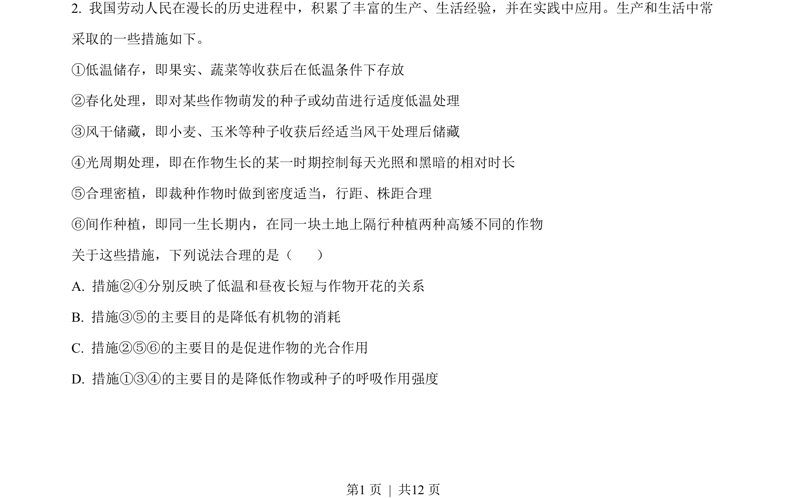
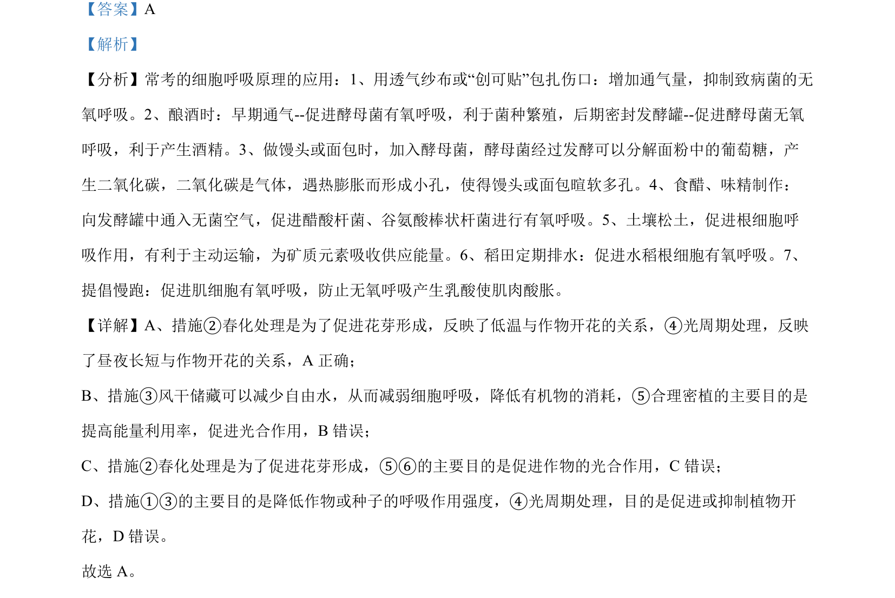

## 题面

## 摘要

农业生产措施与生物学原理的对应，涉及温度、光照对植物开花和代谢的影响

## 关联考点

- [[761-春化作用|春化作用]]
- [[760-光周期|光周期]]
- [[241-细胞呼吸|细胞呼吸]]
- [[033-光合作用|光合作用]]

## 答案与解析

> 📄 原 PDF 第 1 页：`素材/真题/吉林/2008-2024·（吉林）生物高考真题/2023年高考生物试卷（新课标）（解析卷）.pdf`

<!-- 题干文本-start -->
## 题干文本
2. 我国劳动人民在漫长的历史进程中，积累了丰富的生产、生活经验，并在实践中应用。生产和生活中常
采取的一些措施如下。
①低温储存，即果实、蔬菜等收获后在低温条件下存放
②春化处理，即对某些作物萌发的种子或幼苗进行适度低温处理
③风干储藏，即小麦、玉米等种子收获后经适当风干处理后储藏
④光周期处理，即在作物生长的某一时期控制每天光照和黑暗的相对时长
⑤合理密植，即裁种作物时做到密度适当，行距、株距合理
⑥间作种植，即同一生长期内，在同一块土地上隔行种植两种高矮不同的作物
关于这些措施，下列说法合理的是（    ）
A. 措施②④分别反映了低温和昼夜长短与作物开花的关系
B. 措施③⑤的主要目的是降低有机物的消耗
C. 措施②⑤⑥的主要目的是促进作物的光合作用
D. 措施①③④的主要目的是降低作物或种子的呼吸作用强度
<!-- 题干文本-end -->

<!-- 解析文本-start -->
## 解析文本

<!-- 解析文本-end -->
