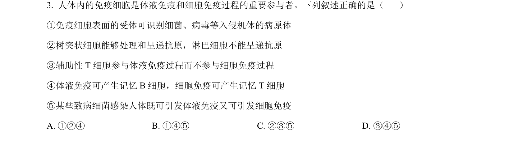
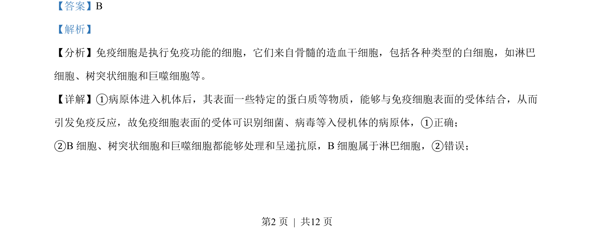
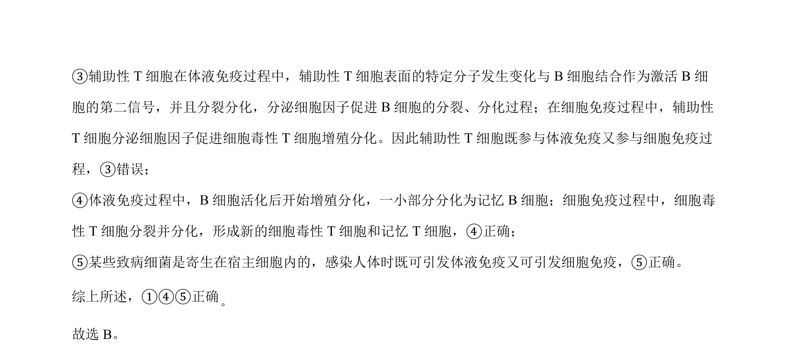

## 题面

## 摘要

本题考察免疫细胞在体液免疫和细胞免疫中的作用，判断相关叙述正误。

## 关联考点

- [[356-免疫细胞|免疫细胞]]
- [[353-体液免疫|体液免疫]]
- [[359-细胞免疫|细胞免疫]]
- [[抗原呈递]]

## 答案与解析

> 📄 原 PDF 第 2 页：`素材/真题/吉林/2008-2024·（吉林）生物高考真题/2023年高考生物试卷（新课标）（解析卷）.pdf`
