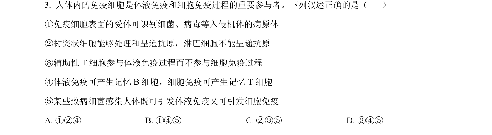
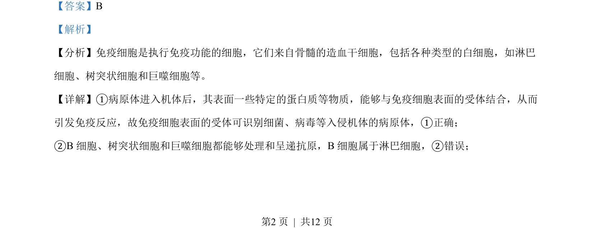
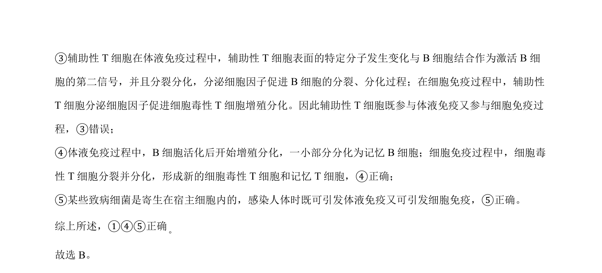

## 题面

## 摘要

本题考察免疫细胞在体液免疫和细胞免疫中的作用，判断相关叙述正误。

## 关联考点

- [[356-免疫细胞|免疫细胞]]
- [[353-体液免疫|体液免疫]]
- [[359-细胞免疫|细胞免疫]]
- [[489-抗原呈递|抗原呈递]]

## 答案与解析

> 📄 原 PDF 第 2 页：`素材/真题/吉林/2008-2024·（吉林）生物高考真题/2023年高考生物试卷（新课标）（解析卷）.pdf`

<!-- 题干文本-start -->
## 题干文本
3. 人体内的免疫细胞是体液免疫和细胞免疫过程的重要参与者。下列叙述正确的是（    ）
①免疫细胞表面的受体可识别细菌、病毒等入侵机体的病原体
②树突状细胞能够处理和呈递抗原，淋巴细胞不能呈递抗原
③辅助性 T细胞参与体液免疫过程而不参与细胞免疫过程
④体液免疫可产生记忆 B细胞，细胞免疫可产生记忆 T细胞
⑤某些致病细菌感染人体既可引发体液免疫又可引发细胞免疫
A. ①②④ B. ①④⑤ C. ②③⑤ D. ③④⑤
<!-- 题干文本-end -->

<!-- 解析文本-start -->
## 解析文本
【答案】B
【解析】
【分析】免疫细胞是执行免疫功能的细胞，它们来自骨髓的造血干细胞，包括各种类型的白细胞，如淋巴
细胞、树突状细胞和巨噬细胞等。
【详解】①病原体进入机体后，其表面一些特定的蛋白质等物质，能够与免疫细胞表面的受体结合，从而
引发免疫反应，故免疫细胞表面的受体可识别细菌、病毒等入侵机体的病原体，①正确；
②B细胞、树突状细胞和巨噬细胞都能够处理和呈递抗原，B细胞属于淋巴细胞，②错误；
<!-- 解析文本-end -->
