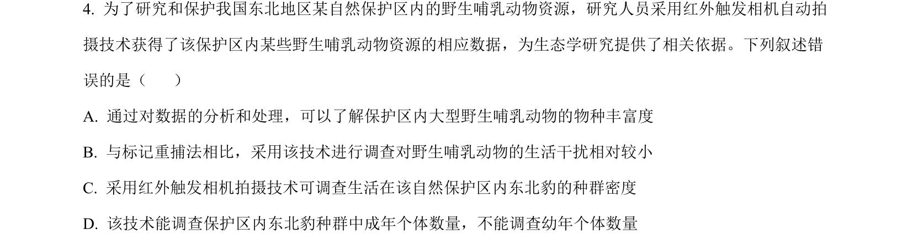
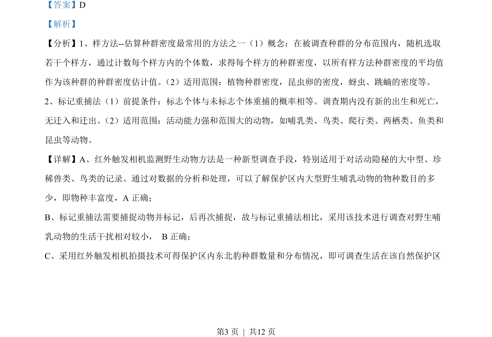
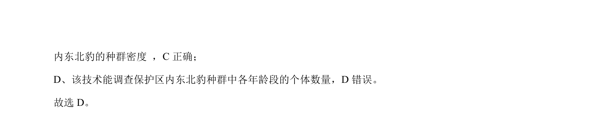

## 题面

## 摘要

该题考查红外触发相机技术在野生动物生态学研究中的应用，辨析其与标记重捕法的区别及数据解读。

## 关联考点

- [[种群密度调查]]
- [[物种丰富度]]
- [[标记重捕法]]
- [[900-数据分析|数据分析]]

## 答案与解析

> 📄 原 PDF 第 3 页：`素材/真题/吉林/2008-2024·（吉林）生物高考真题/2023年高考生物试卷（新课标）（解析卷）.pdf`
