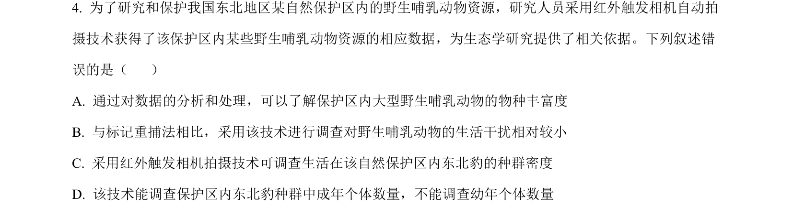
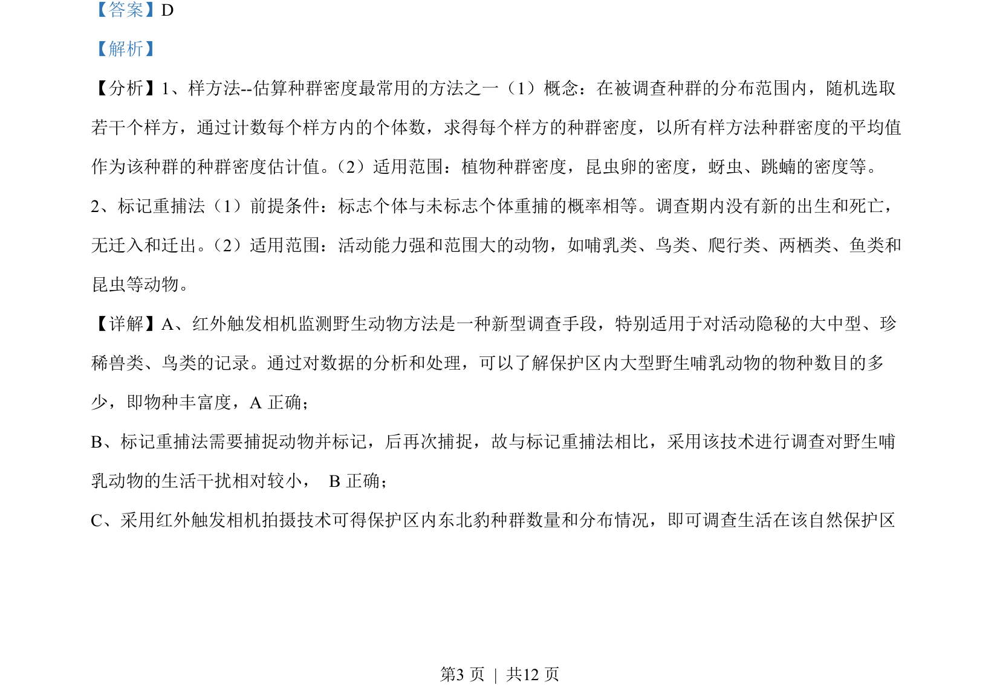
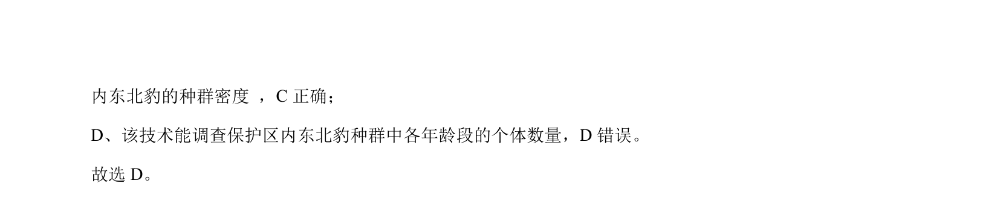

## 题面

## 摘要

该题考查红外触发相机技术在野生动物生态学研究中的应用，辨析其与标记重捕法的区别及数据解读。

## 关联考点

- [[664-种群密度调查|种群密度调查]]
- [[632-物种丰富度|物种丰富度]]
- [[782-标记重捕法|标记重捕法]]
- [[899-数据分析|数据分析]]

## 答案与解析

> 📄 原 PDF 第 3 页：`素材/真题/吉林/2008-2024·（吉林）生物高考真题/2023年高考生物试卷（新课标）（解析卷）.pdf`

<!-- 题干文本-start -->
## 题干文本
4. 为了研究和保护我国东北地区某自然保护区内的野生哺乳动物资源，研究人员采用红外触发相机自动拍
摄技术获得了该保护区内某些野生哺乳动物资源的相应数据，为生态学研究提供了相关依据。下列叙述错
误的是（    ）
A. 通过对数据的分析和处理，可以了解保护区内大型野生哺乳动物的物种丰富度
B. 与标记重捕法相比，采用该技术进行调查对野生哺乳动物的生活干扰相对较小
C. 采用红外触发相机拍摄技术可调查生活在该自然保护区内东北豹的种群密度
D. 该技术能调查保护区内东北豹种群中成年个体数量，不能调查幼年个体数量
<!-- 题干文本-end -->

<!-- 解析文本-start -->
## 解析文本
【答案】D
【解析】
【分析】1、样方法--估算种群密度最常用的方法之一（1）概念：在被调查种群的分布范围内，随机选取
若干个样方，通过计数每个样方内的个体数，求得每个样方的种群密度，以所有样方法种群密度的平均值
作为该种群的种群密度估计值。 （2）适用范围：植物种群密度，昆虫卵的密度，蚜虫、跳蝻的密度等。
2、标记重捕法（1）前提条件：标志个体与未标志个体重捕的概率相等。调查期内没有新的出生和死亡，
无迁入和迁出。 （2）适用范围：活动能力强和范围大的动物，如哺乳类、鸟类、爬行类、两栖类、鱼类和
昆虫等动物。
【详解】A、红外触发相机监测野生动物方法是一种新型调查手段，特别适用于对活动隐秘的大中型、珍
稀兽类、鸟类的记录。通过对数据的分析和处理，可以了解保护区内大型野生哺乳动物的物种数目的多
少，即物种丰富度，A 正确；
B、标记重捕法需要捕捉动物并标记，后再次捕捉，故与标记重捕法相比，采用该技术进行调查对野生哺
乳动物的生活干扰相对较小， B 正确；
C、采用红外触发相机拍摄技术可得保护区内东北豹种群数量和分布情况，即可调查生活在该自然保护区
。
<!-- 解析文本-end -->
