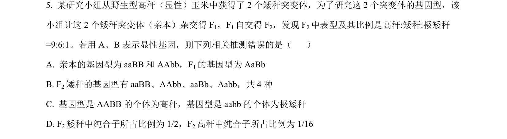
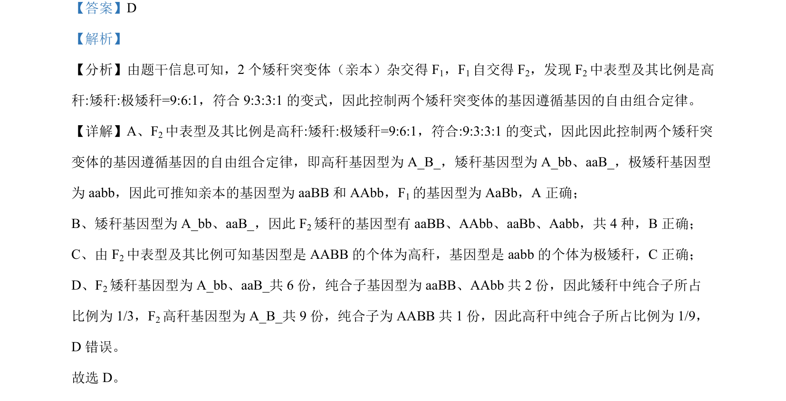

## 题面

## 摘要

6:1性状分离比考查自由组合定律的变式应用与基因型推导。

## 关联考点

- [[272-自由组合定律|自由组合定律]]
- [[602-性状分离比变式|性状分离比变式]]
- [[576-基因型推断|基因型推断]]

## 答案与解析

> 📄 原 PDF 第 4 页：`素材/真题/吉林/2008-2024·（吉林）生物高考真题/2023年高考生物试卷（新课标）（解析卷）.pdf`

<!-- 题干文本-start -->
## 题干文本
5. 某研究小组从野生型高秆（显性）玉米中获得了 2 个矮秆突变体，为了研究这 2 个突变体的基因型，该
小组让这 2 个矮秆突变体（亲本）杂交得 F1，F1自交得 F2，发现 F2中表型及其比例是高秆:矮秆:极矮秆
=9:6:1。若用 A、B表示显性基因，则下列相关推测错误的是（    ）
A. 亲本的基因型为 aaBB和 AAbb，F1的基因型为 AaBb
B. F2矮秆的基因型有 aaBB、AAbb、aaBb、Aabb，共 4 种
C. 基因型是 AABB 的个体为高秆，基因型是 aabb的个体为极矮秆
D. F2矮秆中纯合子所占比例为 1/2，F2高秆中纯合子所占比例为 1/16
<!-- 题干文本-end -->

<!-- 解析文本-start -->
## 解析文本
【答案】D
【解析】
【分析】由题干信息可知，2 个矮秆突变体（亲本）杂交得 F1，F1自交得 F2，发现 F2中表型及其比例是高
秆:矮秆:极矮秆=9:6:1，符合 9:3:3:1的变式，因此控制两个矮秆突变体的基因遵循基因的自由组合定律。
【详解】A、F2中表型及其比例是高秆:矮秆:极矮秆=9:6:1，符合:9:3:3:1的变式，因此因此控制两个矮秆突
变体的基因遵循基因的自由组合定律，即高秆基因型为 A_B_，矮秆基因型为 A_bb、aaB_，极矮秆基因型
为 aabb，因此可推知亲本的基因型为 aaBB和 AAbb，F1的基因型为 AaBb，A 正确；
B、矮秆基因型为 A_bb、aaB_，因此 F2矮秆的基因型有 aaBB、AAbb、aaBb、Aabb，共 4 种，B正确；
C、由 F2中表型及其比例可知基因型是 AABB 的个体为高秆，基因型是 aabb的个体为极矮秆，C正确；
D、F2矮秆基因型为 A_bb、aaB_共 6 份，纯合子基因型为 aaBB、AAbb 共 2 份，因此矮秆中纯合子所占
比例为 1/3，F2高秆基因型为 A_B_共 9 份，纯合子为 AABB 共 1 份，因此高秆中纯合子所占比例为 1/9，
D 错误。
故选 D。
<!-- 解析文本-end -->
