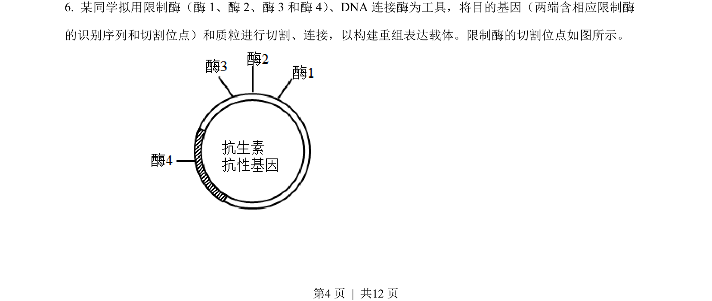
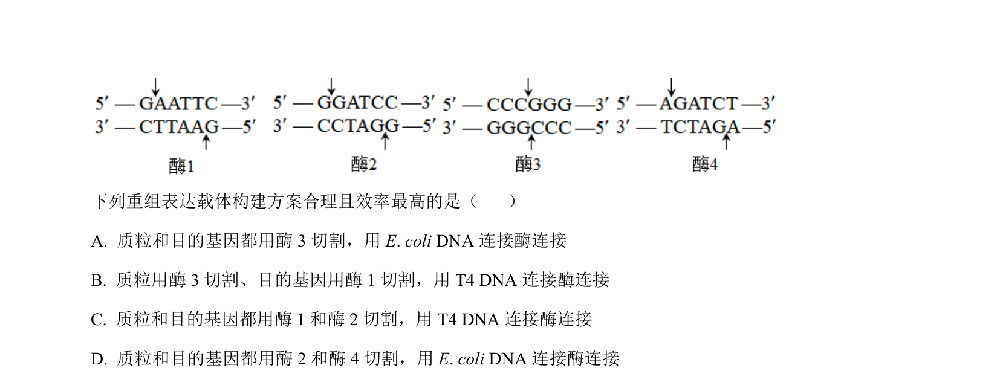
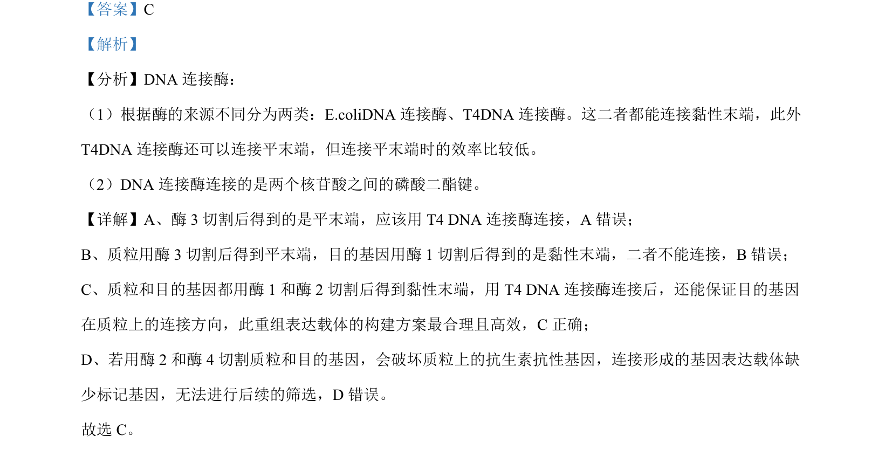

## 题面

## 摘要

本题考查DNA连接酶的类型、特性及基因表达载体的构建方案选择。

## 关联考点

- [[409-DNA连接酶|DNA连接酶]]
- [[黏性末端]]
- [[平末端]]
- [[磷酸二酯键]]

## 答案与解析

> 📄 原 PDF 第 4 页：`素材/真题/吉林/2008-2024·（吉林）生物高考真题/2023年高考生物试卷（新课标）（解析卷）.pdf`
