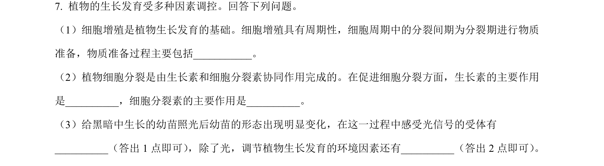
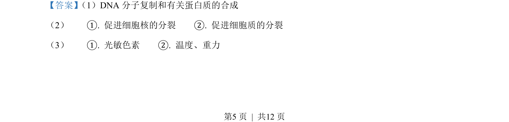
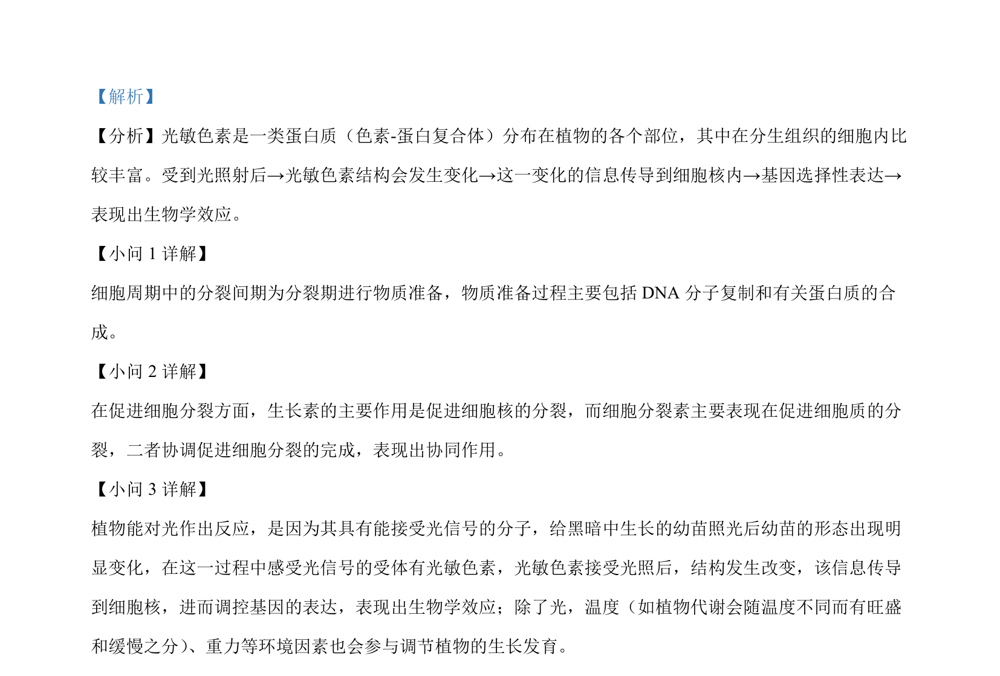

## 题面

## 摘要

本题考查细胞周期中各时期的物质变化及植物激素和环境因素对植物生长发育的调节。

## 关联考点

- [[252-细胞周期|细胞周期]]
- [[347-生长素|生长素]]
- [[349-细胞分裂素|细胞分裂素]]
- [[545-光敏色素|光敏色素]]

## 答案与解析

> 📄 原 PDF 第 5 页：`素材/真题/吉林/2008-2024·（吉林）生物高考真题/2023年高考生物试卷（新课标）（解析卷）.pdf`
