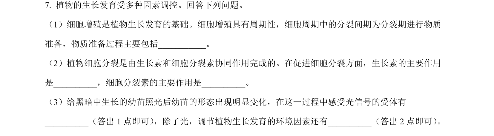
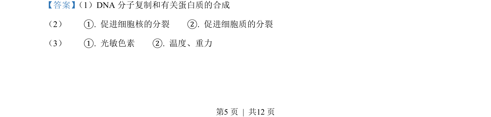
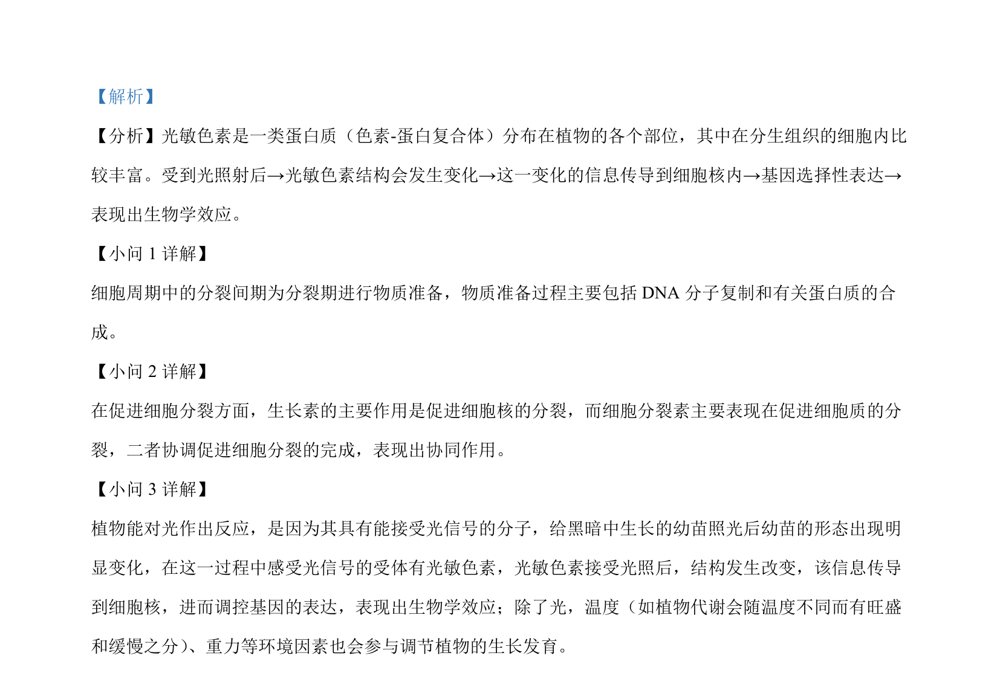

## 题面

## 摘要

本题考查细胞周期中各时期的物质变化及植物激素和环境因素对植物生长发育的调节。

## 关联考点

- [[252-细胞周期|细胞周期]]
- [[347-生长素|生长素]]
- [[349-细胞分裂素|细胞分裂素]]
- [[545-光敏色素|光敏色素]]

## 答案与解析

> 📄 原 PDF 第 5 页：`素材/真题/吉林/2008-2024·（吉林）生物高考真题/2023年高考生物试卷（新课标）（解析卷）.pdf`

<!-- 题干文本-start -->
## 题干文本
7. 植物的生长发育受多种因素调控。回答下列问题。
（1）细胞增殖是植物生长发育的基础。细胞增殖具有周期性，细胞周期中的分裂间期为分裂期进行物质
准备，物质准备过程主要包括___________。
（2）植物细胞分裂是由生长素和细胞分裂素协同作用完成的。在促进细胞分裂方面，生长素的主要作用
是__________，细胞分裂素的主要作用是__________。
（3）给黑暗中生长的幼苗照光后幼苗的形态出现明显变化，在这一过程中感受光信号的受体有
__________（答出 1 点即可） ，除了光，调节植物生长发育的环境因素还有__________（答出 2 点即可） 。
<!-- 题干文本-end -->

<!-- 解析文本-start -->
## 解析文本
【答案】 （1）DNA 分子复制和有关蛋白质的合成    
（2）    ①. 促进细胞核的分裂    ②. 促进细胞质的分裂    
（3）    ①. 光敏色素    ②. 温度、重力
<!-- 解析文本-end -->
