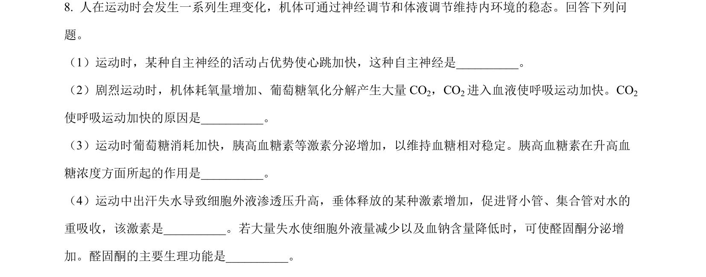
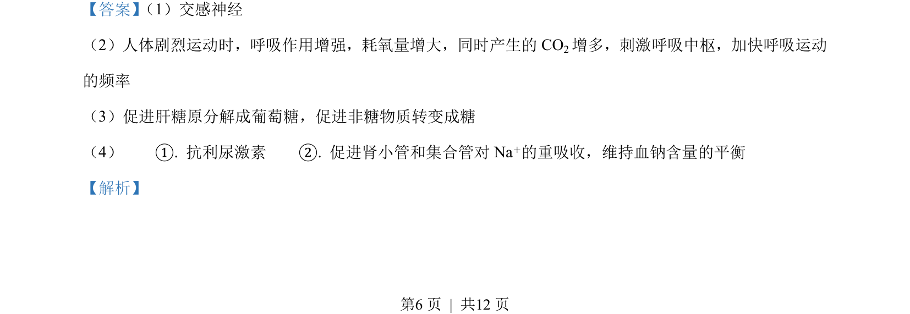
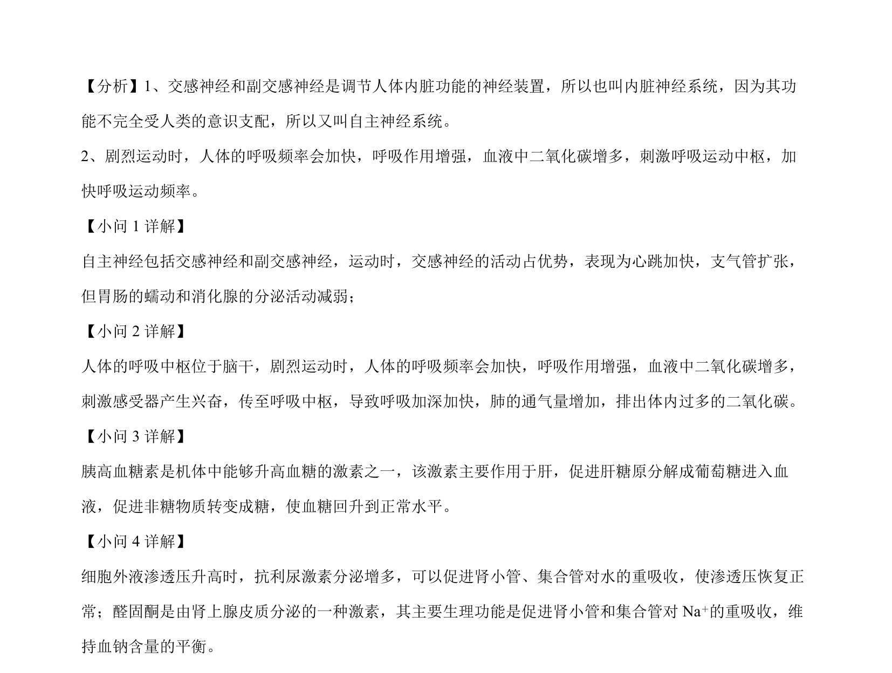

## 题面

## 摘要

该题考查人体神经-体液调节、生态系统能量流动与生态位、果蝇遗传规律的综合应用。

## 关联考点

- [[324-神经调节|神经调节]]
- [[330-体液调节|体液调节]]
- [[385-生态系统能量流动|能量流动]]
- [[生态位]]
- [[276-伴性遗传|伴性遗传]]

## 答案与解析

> 📄 原 PDF 第 6 页：`素材/真题/吉林/2008-2024·（吉林）生物高考真题/2023年高考生物试卷（新课标）（解析卷）.pdf`
