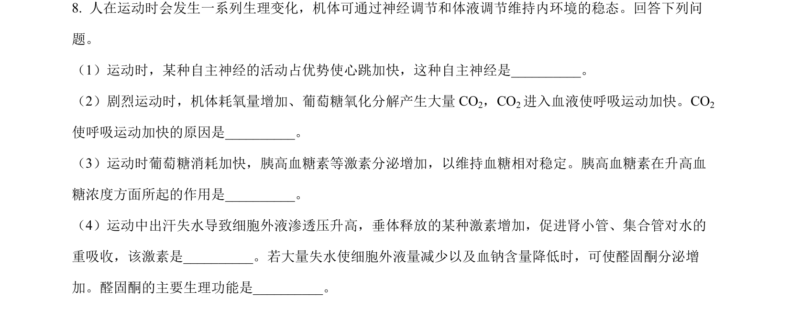
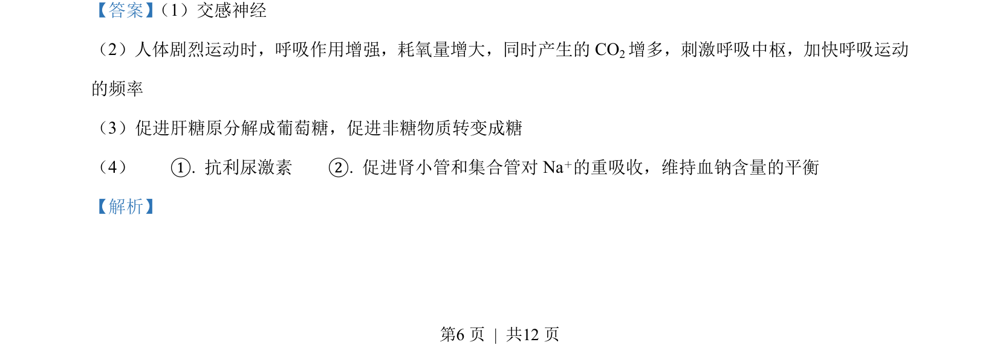
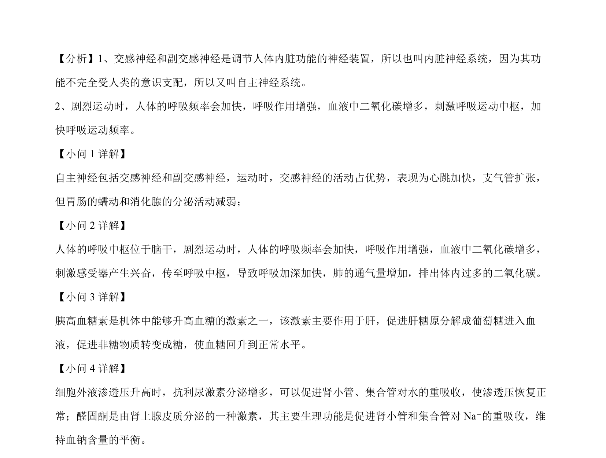

## 题面

## 摘要

以运动为情境，综合考查神经调节与体液调节协同维持内环境稳态，涉及血糖、呼吸和水盐调节。

## 关联考点

- [[324-神经调节|神经调节]]
- [[330-体液调节|体液调节]]
- [[314-内环境稳态|内环境稳态]]
- [[512-血糖调节|血糖调节]]

## 答案与解析

> 📄 原 PDF 第 6 页：`素材/真题/吉林/2008-2024·（吉林）生物高考真题/2023年高考生物试卷（新课标）（解析卷）.pdf`

<!-- 题干文本-start -->
## 题干文本
8. 人在运动时会发生一系列生理变化，机体可通过神经调节和体液调节维持内环境的稳态。回答下列问
题。
（1）运动时，某种自主神经的活动占优势使心跳加快，这种自主神经是__________。
（2）剧烈运动时，机体耗氧量增加、葡萄糖氧化分解产生大量 CO2，CO2进入血液使呼吸运动加快。CO2
使呼吸运动加快的原因是__________。
（3）运动时葡萄糖消耗加快，胰高血糖素等激素分泌增加，以维持血糖相对稳定。胰高血糖素在升高血
糖浓度方面所起的作用是__________。
（4）运动中出汗失水导致细胞外液渗透压升高，垂体释放的某种激素增加，促进肾小管、集合管对水的
重吸收，该激素是__________。若大量失水使细胞外液量减少以及血钠含量降低时，可使醛固酮分泌增
加。醛固酮的主要生理功能是__________。
<!-- 题干文本-end -->

<!-- 解析文本-start -->
## 解析文本
【答案】 （1）交感神经    
（2）人体剧烈运动时，呼吸作用增强，耗氧量增大，同时产生的CO2增多，刺激呼吸中枢，加快呼吸运动
的频率    
（3）促进肝糖原分解成葡萄糖，促进非糖物质转变成糖    
（4）    ①. 抗利尿激素    ②. 促进肾小管和集合管对 Na＋的重吸收，维持血钠含量的平衡
【解析】
<!-- 解析文本-end -->
