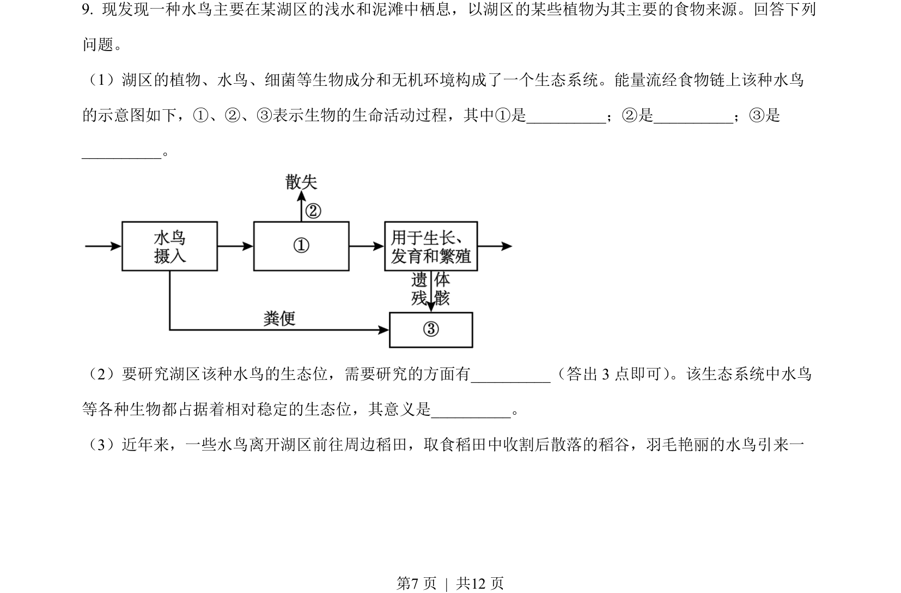
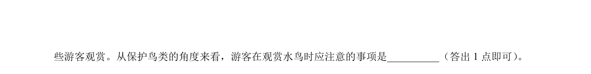
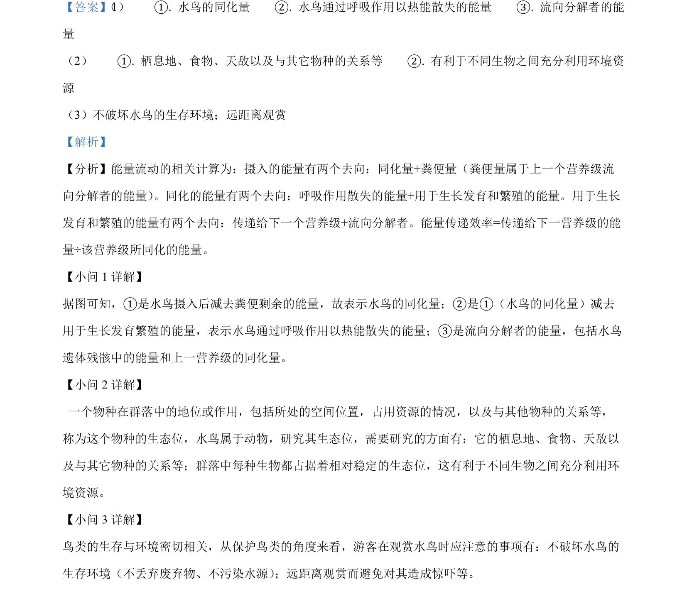

## 题面

## 摘要

该题考查生态系统的组成、能量流动过程及生态位研究内容与意义。

## 关联考点

- [[020-生态系统|生态系统]]
- [[385-生态系统能量流动|能量流动]]
- [[501-生态位|生态位]]

## 答案与解析

> 📄 原 PDF 第 7 页：`素材/真题/吉林/2008-2024·（吉林）生物高考真题/2023年高考生物试卷（新课标）（解析卷）.pdf`
