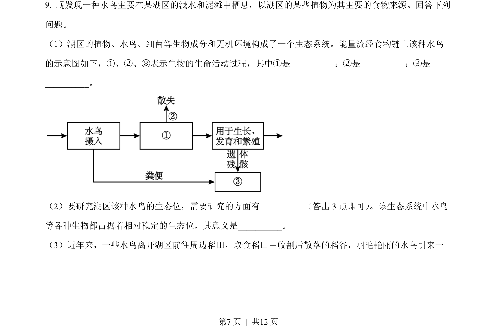
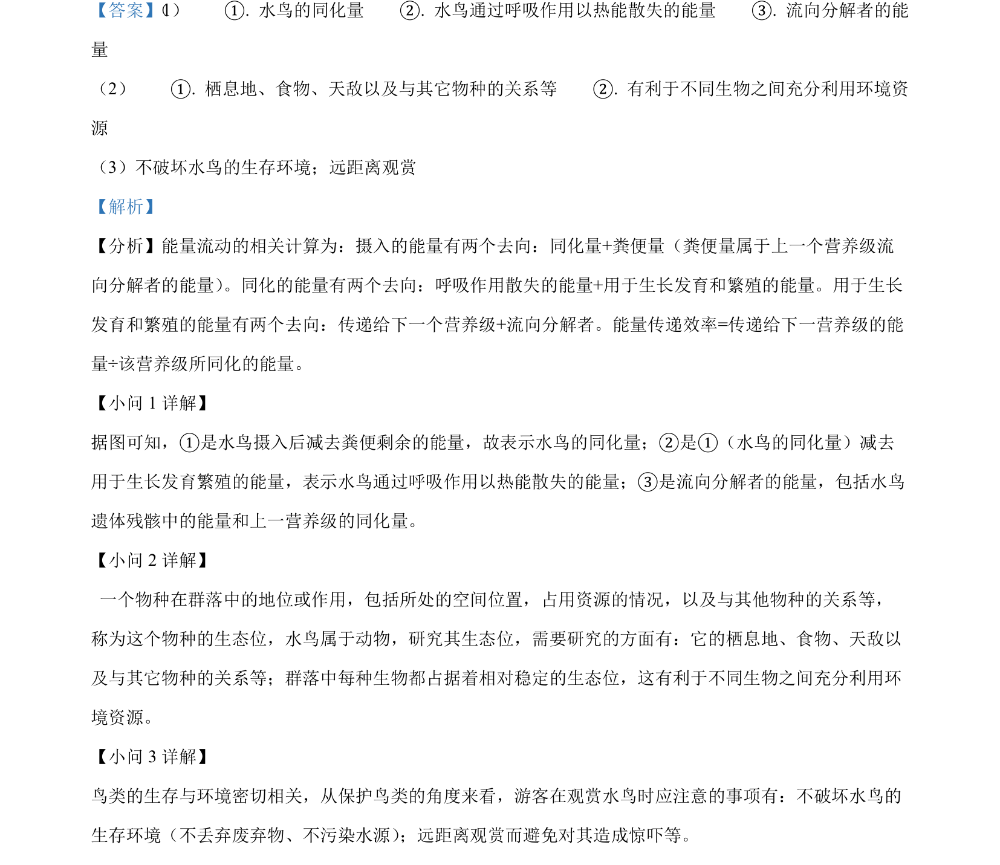

## 题面

## 摘要

该题考查生态系统的组成、能量流动过程及生态位研究内容与意义。

## 关联考点

- [[020-生态系统|生态系统]]
- [[385-生态系统能量流动|能量流动]]
- [[501-生态位|生态位]]

## 答案与解析

> 📄 原 PDF 第 7 页：`素材/真题/吉林/2008-2024·（吉林）生物高考真题/2023年高考生物试卷（新课标）（解析卷）.pdf`

<!-- 题干文本-start -->
## 题干文本
9. 现发现一种水鸟主要在某湖区的浅水和泥滩中栖息，以湖区的某些植物为其主要的食物来源。回答下列
问题。
（1）湖区的植物、水鸟、细菌等生物成分和无机环境构成了一个生态系统。能量流经食物链上该种水鸟
的示意图如下，①、②、③表示生物的生命活动过程，其中①是__________；②是__________；③是
__________。
  
（2）要研究湖区该种水鸟的生态位，需要研究的方面有__________（答出 3 点即可） 。该生态系统中水鸟
等各种生物都占据着相对稳定的生态位，其意义是__________。
（3）近年来，一些水鸟离开湖区前往周边稻田，取食稻田中收割后散落的稻谷，羽毛艳丽的水鸟引来一
<!-- 题干文本-end -->

<!-- 解析文本-start -->
## 解析文本

<!-- 解析文本-end -->
