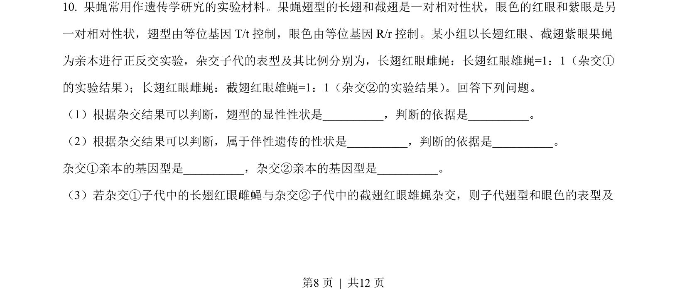
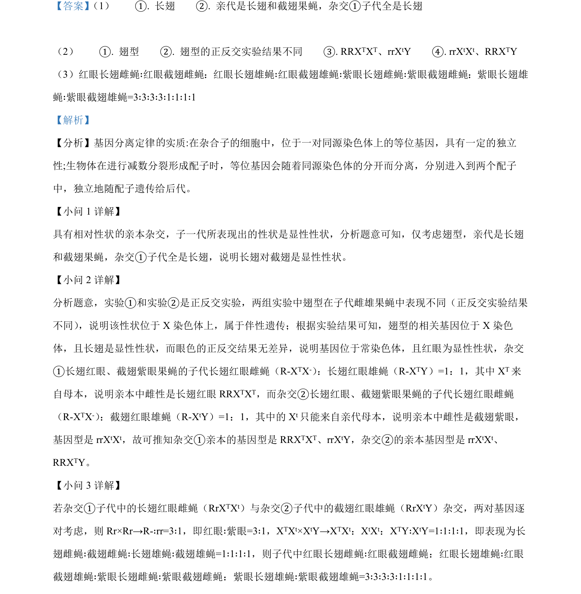

## 题面

## 摘要

该题通过果蝇杂交实验考查伴性遗传与自由组合定律的推断应用。

## 关联考点

- [[517-遗传规律|遗传规律]]
- [[276-伴性遗传|伴性遗传]]
- [[576-基因型推断|基因型推断]]

## 答案与解析

> 📄 原 PDF 第 8 页：`素材/真题/吉林/2008-2024·（吉林）生物高考真题/2023年高考生物试卷（新课标）（解析卷）.pdf`
