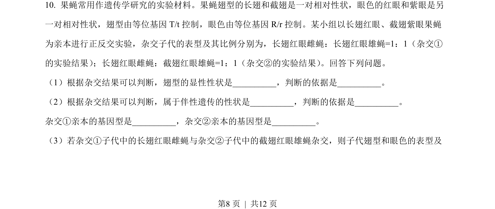
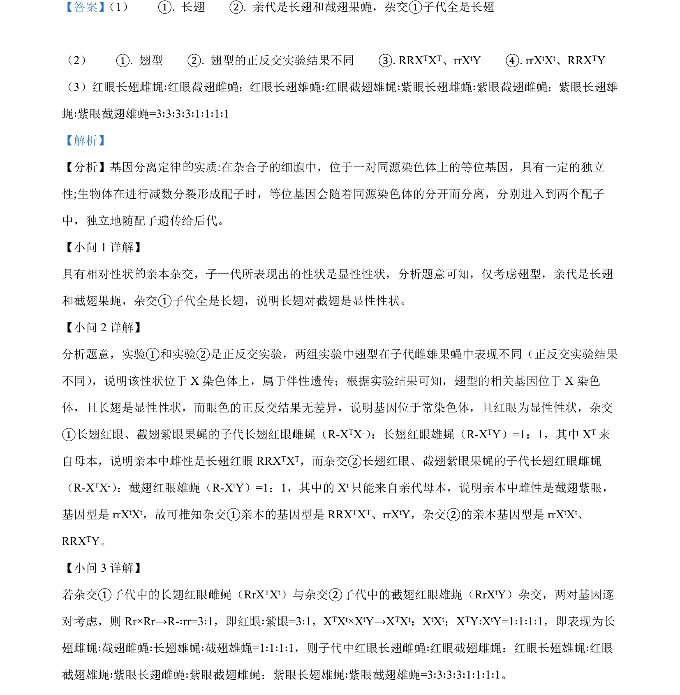

## 题面

## 摘要

该题通过果蝇杂交实验考查伴性遗传与自由组合定律的推断应用。

## 关联考点

- [[517-遗传规律|遗传规律]]
- [[276-伴性遗传|伴性遗传]]
- [[576-基因型推断|基因型推断]]

## 答案与解析

> 📄 原 PDF 第 8 页：`素材/真题/吉林/2008-2024·（吉林）生物高考真题/2023年高考生物试卷（新课标）（解析卷）.pdf`

<!-- 题干文本-start -->
## 题干文本
10. 果蝇常用作遗传学研究的实验材料。果蝇翅型的长翅和截翅是一对相对性状，眼色的红眼和紫眼是另
一对相对性状，翅型由等位基因 T/t控制，眼色由等位基因 R/r控制。某小组以长翅红眼、截翅紫眼果蝇
为亲本进行正反交实验，杂交子代的表型及其比例分别为，长翅红眼雌蝇：长翅红眼雄蝇=1：1（杂交①
的实验结果） ；长翅红眼雌蝇：截翅红眼雄蝇=1：1（杂交②的实验结果） 。回答下列问题。
（1）根据杂交结果可以判断，翅型的显性性状是__________，判断的依据是__________。
（2）根据杂交结果可以判断，属于伴性遗传的性状是__________，判断的依据是__________。
杂交①亲本的基因型是__________，杂交②亲本的基因型是__________。
（3）若杂交①子代中的长翅红眼雌蝇与杂交②子代中的截翅红眼雄蝇杂交，则子代翅型和眼色的表型及
<!-- 题干文本-end -->

<!-- 解析文本-start -->
## 解析文本

<!-- 解析文本-end -->
