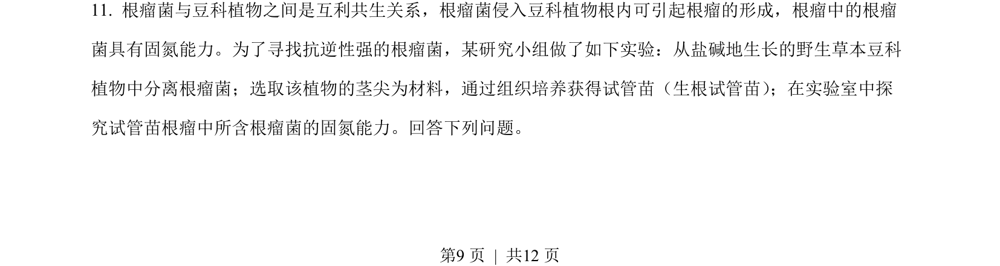
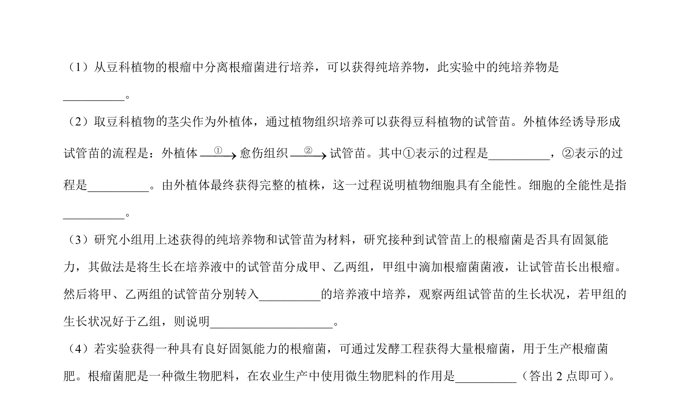
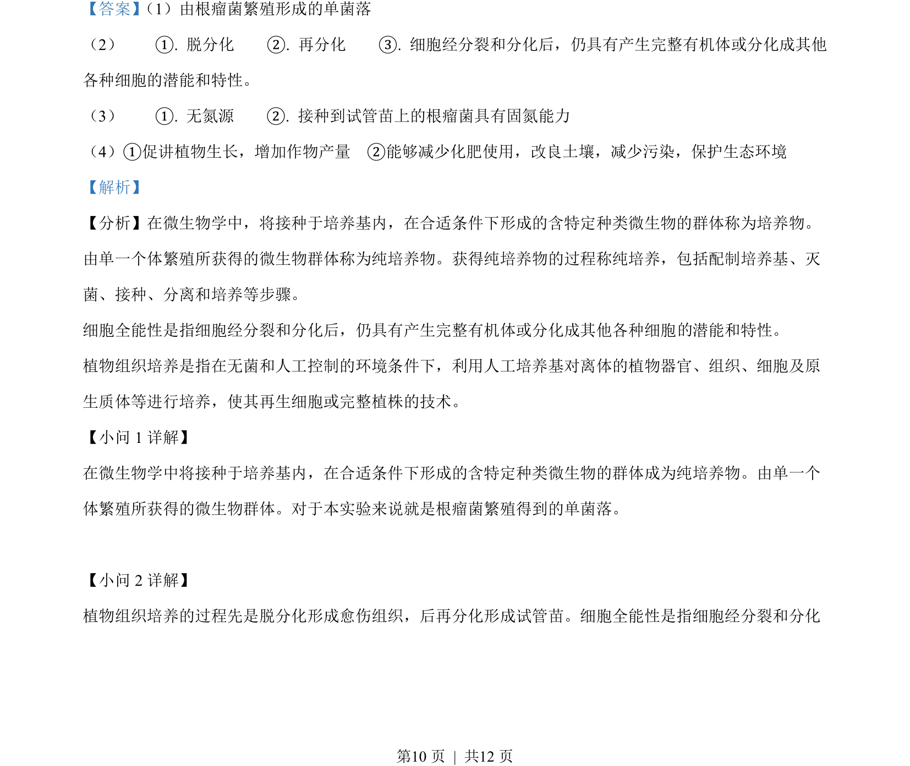
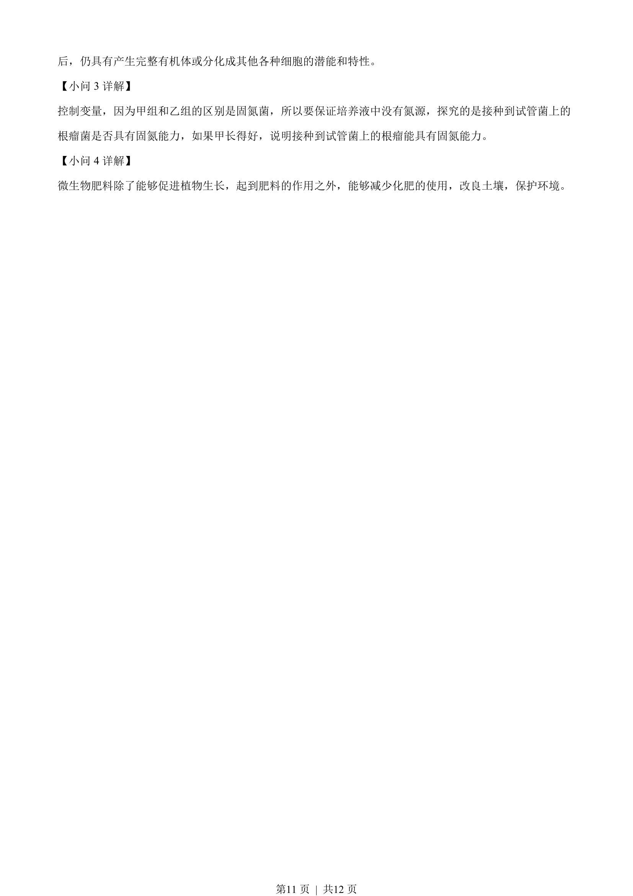

## 题面

## 摘要

该题考查根瘤菌与豆科植物的互利共生关系及利用植物组织培养探究根瘤菌固氮能力的实验设计。

## 关联考点

- [[404-互利共生|互利共生]]
- [[571-固氮作用|生物固氮]]
- [[437-植物组织培养|植物组织培养]]
- [[482-实验设计|实验探究]]

## 答案与解析

> 📄 原 PDF 第 9 页：`素材/真题/吉林/2008-2024·（吉林）生物高考真题/2023年高考生物试卷（新课标）（解析卷）.pdf`
