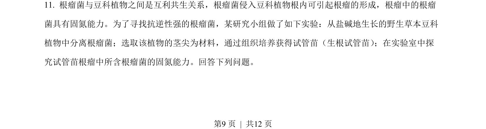
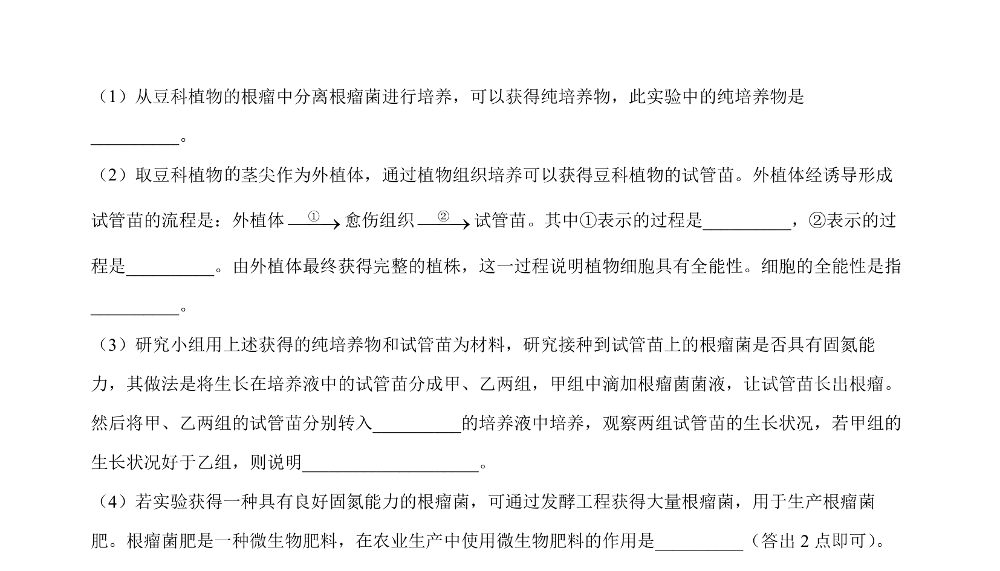
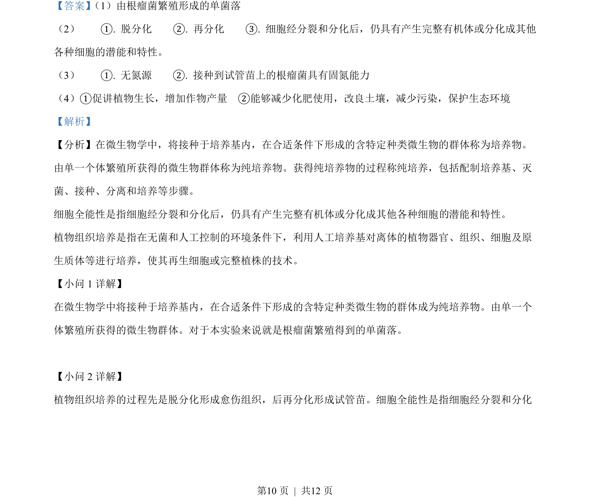
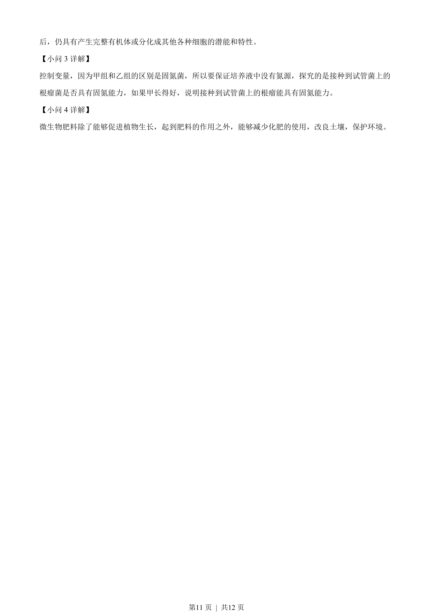

## 题面

## 摘要

该题考查根瘤菌与豆科植物的互利共生关系及利用植物组织培养探究根瘤菌固氮能力的实验设计。

## 关联考点

- [[404-互利共生|互利共生]]
- [[571-固氮作用|生物固氮]]
- [[437-植物组织培养|植物组织培养]]
- [[482-实验设计|实验探究]]

## 答案与解析

> 📄 原 PDF 第 9 页：`素材/真题/吉林/2008-2024·（吉林）生物高考真题/2023年高考生物试卷（新课标）（解析卷）.pdf`

<!-- 题干文本-start -->
## 题干文本
11. 根瘤菌与豆科植物之间是互利共生关系，根瘤菌侵入豆科植物根内可引起根瘤的形成，根瘤中的根瘤
菌具有固氮能力。为了寻找抗逆性强的根瘤菌，某研究小组做了如下实验：从盐碱地生长的野生草本豆科
植物中分离根瘤菌；选取该植物的茎尖为材料，通过组织培养获得试管苗（生根试管苗） ；在实验室中探
究试管苗根瘤中所含根瘤菌的固氮能力。回答下列问题。
的的
<!-- 题干文本-end -->

<!-- 解析文本-start -->
## 解析文本

<!-- 解析文本-end -->
